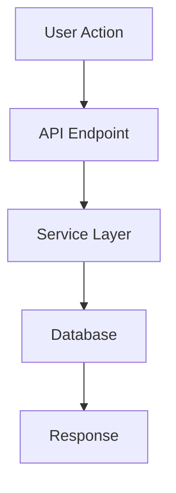
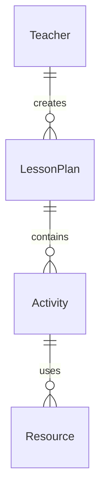

# Agent Documentation Instructions

## 🎯 Purpose

This document provides AI coding agents with detailed instructions for creating and maintaining comprehensive documentation throughout the Teaching Engine 2.0 project. Proper documentation ensures that all design decisions, implementation choices, and code patterns are clearly explained for future agents and human developers.

## 📋 Documentation Requirements

### 1. Mandatory Documentation for Every Feature

When implementing any feature, agents MUST create or update these documentation types:

#### A. Technical Specification Document

**File Pattern**: `docs/specs/FEATURE_NAME.md`
**Required Sections**:

```markdown
# Feature Name - Technical Specification

## Overview

- Brief description of what this feature does
- How it fits into the overall Teaching Engine 2.0 system
- Primary user benefits

## Requirements

- Functional requirements (what it must do)
- Non-functional requirements (performance, security, etc.)
- Integration requirements (APIs, external services)

## Architecture

- Database schema changes (if any)
- API endpoints (request/response formats)
- Frontend components structure
- Data flow diagrams (use Mermaid syntax)

## Implementation Details

- Key algorithms or business logic
- External service integrations
- Error handling strategies
- Security considerations

## Testing Strategy

- Unit test scenarios
- Integration test requirements
- E2E test flows
- Performance benchmarks

## Deployment Considerations

- Environment variables needed
- Database migrations required
- Infrastructure changes
- Rollback procedures

## Success Criteria

- Measurable acceptance criteria
- Performance targets
- User experience goals
```

#### B. API Documentation

**File Pattern**: `docs/api/ENDPOINT_NAME.md`
**Required for each new API endpoint**:

````markdown
# API Endpoint: [METHOD] /api/path

## Description

Brief explanation of what this endpoint does.

## Authentication

- Required auth level
- Headers needed

## Request

### Parameters

| Parameter | Type   | Required | Description |
| --------- | ------ | -------- | ----------- |
| param1    | string | Yes      | Description |

### Body (if applicable)

```json
{
  "example": "request body"
}
```
````

## Response

### Success (200/201)

```json
{
  "example": "response body"
}
```

### Error Responses

| Status | Description | Response Body          |
| ------ | ----------- | ---------------------- |
| 400    | Bad Request | `{"error": "message"}` |
| 404    | Not Found   | `{"error": "message"}` |

## Examples

### cURL Example

```bash
curl -X POST https://api.example.com/endpoint \
  -H "Content-Type: application/json" \
  -d '{"data": "example"}'
```

### JavaScript Example

```javascript
const response = await fetch('/api/endpoint', {
  method: 'POST',
  headers: { 'Content-Type': 'application/json' },
  body: JSON.stringify({ data: 'example' }),
});
```

````

#### C. Component Documentation
**File Pattern**: Add JSDoc comments directly in component files
**Required for React components**:
```typescript
/**
 * ComponentName - Brief description of what this component does
 *
 * @description Detailed explanation of the component's purpose, when to use it,
 * and how it fits into the overall UI structure.
 *
 * @param {ComponentProps} props - Description of props
 * @param {string} props.title - The title to display
 * @param {Function} props.onSubmit - Callback when form is submitted
 * @param {boolean} [props.isLoading=false] - Whether to show loading state
 *
 * @example
 * ```tsx
 * <ComponentName
 *   title="Example Title"
 *   onSubmit={(data) => console.log(data)}
 *   isLoading={false}
 * />
 * ```
 *
 * @returns {JSX.Element} The rendered component
 */
export const ComponentName: React.FC<ComponentProps> = ({
  title,
  onSubmit,
  isLoading = false
}) => {
  // Component implementation
};
````

### 2. Decision Log Documentation

For significant architectural or design decisions, create entries in:
**File**: `docs/decisions/DECISION_LOG.md`

**Format**:

```markdown
## Decision: [Title] - [Date]

### Context

What situation led to this decision?

### Options Considered

1. Option A - Pros/Cons
2. Option B - Pros/Cons
3. Option C - Pros/Cons

### Decision

Which option was chosen and why?

### Consequences

- Positive outcomes expected
- Negative trade-offs accepted
- Future considerations

### Implementation Notes

Any specific implementation guidance or gotchas.

---
```

### 3. Code Pattern Documentation

When introducing new patterns, document them in:
**File**: `docs/patterns/PATTERN_NAME.md`

**Required Sections**:

- **When to Use**: Scenarios where this pattern applies
- **Implementation**: Step-by-step guide with code examples
- **Alternatives**: When not to use this pattern
- **Examples**: Real implementations in the codebase

### 4. Database Documentation

For schema changes, update:
**File**: `docs/database/SCHEMA.md`

**Include**:

- Entity relationship diagrams (Mermaid)
- Table descriptions and purposes
- Index strategies
- Migration notes
- Data flow explanations

## 🤖 Agent-Specific Documentation Tasks

### During Development

1. **Before Starting**: Update your agent log with planned approach
2. **During Implementation**: Document decisions as you make them
3. **After Completion**: Create comprehensive documentation package
4. **Before PR**: Ensure all documentation is complete and accurate

### Agent Log Requirements

**File Pattern**: `AGENT-[NAME]-LOG.md`
**Update after each work session**:

```markdown
# Agent [NAME] Development Log

## Current Status: [ACTIVE/IDLE/COMPLETE]

## Last Updated: [Date]

## Current Task

Brief description of what you're working on.

## Progress Summary

- [x] Completed task 1
- [x] Completed task 2
- [ ] In progress task 3
- [ ] Pending task 4

## Recent Decisions Made

### [Date] - Decision Title

- **Context**: Why this decision was needed
- **Choice**: What was decided
- **Rationale**: Why this choice was made
- **Impact**: How this affects other parts of the system

## Implementation Notes

Technical details that other agents should know:

- Code patterns used
- Dependencies added/removed
- Configuration changes
- Testing approaches

## Blockers/Issues

Any problems encountered:

- Description of issue
- Attempted solutions
- Current status
- Help needed (if any)

## Next Steps

What needs to happen next:

1. Specific next action
2. Dependencies to resolve
3. Coordination needed with other agents

## Files Modified

List of all files changed with brief description of changes:

- `path/to/file.ts` - Added new function for X
- `path/to/test.ts` - Updated tests for Y

## Code Review Notes

Things to check during review:

- Specific areas that need attention
- Edge cases to verify
- Performance considerations
- Security implications
```

## 📝 Documentation Quality Standards

### Writing Guidelines

1. **Clarity**: Write for the next agent/developer who has never seen this code
2. **Completeness**: Include all information needed to understand and use the feature
3. **Accuracy**: Ensure all code examples work and all specifications are correct
4. **Maintenance**: Update documentation when code changes

### Code Examples Requirements

- **Working Examples**: All code samples must be tested and functional
- **Real Data**: Use realistic examples that match the Teaching Engine context
- **Multiple Scenarios**: Show both simple and complex use cases
- **Error Handling**: Include examples of proper error handling

### Diagram Standards

Use Mermaid syntax for all diagrams. Common patterns:





## 🔍 Documentation Review Process

### Self-Review Checklist

Before marking documentation complete, verify:

- [ ] All required sections are present and complete
- [ ] Code examples are tested and working
- [ ] API documentation matches actual implementation
- [ ] Diagrams are clear and accurate
- [ ] No spelling or grammar errors
- [ ] Links to other documentation work
- [ ] Screenshots/images are current and clear

### Peer Agent Review

When multiple agents are working:

1. **Cross-Reference**: Check if your documentation conflicts with others
2. **Integration Points**: Ensure interface documentation matches
3. **Consistency**: Follow the same patterns as other agents
4. **Completeness**: Verify nothing is missing from the overall picture

## 🚀 Documentation Automation

### Auto-Generated Documentation

Some documentation should be automatically generated:

1. **API Docs**: Use OpenAPI/Swagger for REST endpoints
2. **Type Docs**: Generate TypeScript interface documentation
3. **Test Coverage**: Include coverage reports in documentation
4. **Dependencies**: Auto-update dependency lists

### Documentation Testing

Treat documentation as code:

1. **Link Checking**: Verify all internal/external links work
2. **Code Example Testing**: Run all documentation code examples
3. **Diagram Validation**: Ensure Mermaid diagrams render correctly
4. **Spelling/Grammar**: Use automated tools for quality checking

## 📚 Documentation Templates

### Quick Reference Templates

**New Feature Checklist**:

```markdown
## Documentation Checklist for [Feature Name]

- [ ] Technical specification created (`docs/specs/`)
- [ ] API endpoints documented (`docs/api/`)
- [ ] Component JSDoc comments added
- [ ] Decision log updated (if applicable)
- [ ] Database schema documented (if applicable)
- [ ] Code patterns documented (if new)
- [ ] Agent log updated
- [ ] README updated (if user-facing)
- [ ] All code examples tested
- [ ] Diagrams created and verified
```

**Bug Fix Documentation**:

```markdown
## Bug Fix: [Title]

### Issue Description

What was broken and how it manifested.

### Root Cause

Why the bug occurred.

### Solution

How it was fixed.

### Prevention

What was changed to prevent similar issues.

### Testing

How the fix was verified.
```

## 🎯 Success Criteria

Documentation is considered complete when:

1. **A new agent** can understand and work with the feature using only the documentation
2. **A human developer** can maintain the code without asking questions
3. **End users** can successfully use new features following the guides
4. **Integration tests** pass using the documented APIs
5. **All stakeholders** can understand the business value and technical decisions

## 🔧 Tools and Resources

### Recommended Tools

- **Mermaid**: For diagrams and flowcharts
- **JSDoc**: For JavaScript/TypeScript documentation
- **OpenAPI**: For REST API documentation
- **Markdown**: For all written documentation
- **PlantUML**: Alternative for complex diagrams

### Documentation Validation

- Spell checkers (aspell, cspell)
- Link checkers (markdown-link-check)
- Diagram validators (mermaid-cli)
- Code example runners (doctest style)

---

**Remember**: Good documentation is not just about explaining what the code does—it's about explaining why decisions were made, how components work together, and what the intended user experience should be. When in doubt, over-document rather than under-document.
