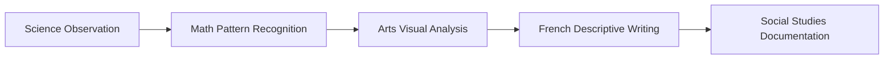

# Cross-Pollination Guide for Grade 1 French Immersion
## 53 Unit Plans - Maximum Integration Opportunities

> This guide documents all cross-curricular connections to enable efficient lesson planning with natural integration across subjects while maintaining individual learning objectives.

---

## 📅 Monthly Integration Maps

### September: "Bienvenue à l'école!" (Welcome to School!)
**10 Concurrent Units - Foundation Building**

| Subject | Unit | Key Connections | Shared Resources |
|---------|------|-----------------|------------------|
| **Français** | Bienvenue en immersion française! | All subjects - French vocabulary foundation | Name cards, classroom labels |
| **Mathématiques** | Les nombres tout autour de nous | Science counting, PE movement patterns | Number cards, manipulatives |
| **Sciences humaines** | Notre communauté de classe | FPS identity, French community vocabulary | Community photos, maps |
| **Sciences de la nature** | Explorer avec nos sens | Math observation, Arts sensory exploration | Sensory materials, observation tools |
| **Arts visuels** | Découvrir l'art en nous | French descriptive vocabulary, Science observation | Art materials, nature items |
| **Music** | Discovering Musical Play | French songs, Math patterns, PE movement | Instruments, rhythm cards |
| **FPS** | Mon corps en mouvement | Science body awareness, French body parts | Body diagrams, movement cards |
| **Éducation physique** | Fundamental Movement Skills | Science force/motion, Math spatial awareness | Movement equipment |

**Cross-Pollination Opportunities:**
- Morning circle combines French greetings, Math calendar, Science weather observation
- Name activities span French, Social Studies, Arts self-portraits
- Classroom routines integrate French instructions across all subjects
- Number awareness activities in Math support Science data collection

### October-November: "Ma famille et notre communauté" (My Family and Our Community)
**Focus: Identity, Relationships, Celebrations**

| Thematic Connection | Subjects Involved | Shared Vocabulary | Integration Points |
|-------------------|-------------------|-------------------|-------------------|
| **Family Structures** | French, Social Studies, FPS, Arts | famille, maison, aimer, ensemble | Family trees, portraits, stories |
| **Celebrations** | Social Studies, Arts, Music, French | célébrer, fête, tradition, partager | Cultural events, art projects, songs |
| **Community Helpers** | Social Studies, French, FPS (safety) | aider, travail, sécurité, merci | Role play, vocabulary, safety rules |
| **Fall Observations** | Science, Math, Arts, French | automne, feuille, couleur, compter | Nature walks, collections, patterns |

### December-February: "L'hiver et les festivités" (Winter and Festivities)
**Focus: Seasonal Changes, Celebrations, Patterns**

| Thematic Connection | Subjects Involved | Shared Vocabulary | Integration Points |
|-------------------|-------------------|-------------------|-------------------|
| **Winter Science** | Science, Math, French, Arts | neige, froid, mesurer, observer | Weather tracking, measurement, descriptions |
| **Holiday Traditions** | Social Studies, Music, Arts, French | tradition, lumière, donner, joie | Cultural studies, crafts, performances |
| **Pattern & Design** | Math, Arts, Music, PE | répéter, motif, rythme, suivre | Pattern blocks, art designs, movement sequences |
| **Indoor Activities** | PE, FPS, Science, Math | bouger, équilibre, force, compter | Movement exploration, body awareness |

### March-May: "Le printemps et la croissance" (Spring and Growth)
**Focus: Growth, Change, Reflection**

| Thematic Connection | Subjects Involved | Shared Vocabulary | Integration Points |
|-------------------|-------------------|-------------------|-------------------|
| **Plant Growth** | Science, Math, French, Arts | plante, grandir, mesurer, observer | Garden project, growth charts, journals |
| **Life Cycles** | Science, French, Arts, Social Studies | changer, nouveau, cycle, temps | Observations, timelines, representations |
| **Environmental Care** | Science, Social Studies, FPS, French | protéger, terre, eau, responsable | Earth Day, conservation, actions |
| **Year Reflection** | All subjects | apprendre, progrès, fier, portfolio | Portfolios, celebrations, exhibitions |

---

## 🔤 Shared Vocabulary Database

### Tier 1: High-Frequency Cross-Curricular Words (10+ appearances)
These words appear across multiple subjects and should be prioritized for word walls:

| French | English | Subjects | Contexts |
|--------|---------|----------|----------|
| **grandir** | grow | Science, Math, FPS, French, Arts | Plants, bodies, numbers, stories |
| **ensemble** | together | All subjects | Collaboration, community, group work |
| **partager** | share | Social Studies, Math, FPS, French | Materials, ideas, fair shares |
| **observer** | observe | Science, Math, Arts, French | Scientific method, patterns, art appreciation |
| **compter** | count | Math, Science, PE, Music | Numbers, data, beats, movements |
| **mesurer** | measure | Math, Science, PE, Arts | Length, time, distance, proportions |
| **couleur** | color | Arts, Science, Math, French | Art, nature, patterns, descriptions |
| **forme** | shape | Math, Arts, Science, PE | Geometry, design, classification, spatial awareness |
| **ami(e)** | friend | FPS, French, Social Studies | Relationships, community, social skills |
| **sécurité** | safety | FPS, PE, Science, Social Studies | Rules, procedures, awareness |

### Tier 2: Subject-Bridging Vocabulary (5-9 appearances)
Important for making connections between subjects:

| French | English | Primary Subjects | Secondary Subjects |
|--------|---------|-----------------|-------------------|
| **explorer** | explore | Science, Social Studies | Arts, PE, Math |
| **créer** | create | Arts, French | Music, Science, Math |
| **bouger** | move | PE, FPS | Science (force), Music (dance) |
| **temps** | time/weather | Science, Math | Social Studies, French |
| **famille** | family | Social Studies, French | FPS, Arts |
| **corps** | body | FPS, PE | Science, French |
| **nature** | nature | Science, Arts | French, Social Studies |
| **rythme** | rhythm | Music, PE | Math (patterns), French |
| **espace** | space | Math, PE | Arts, Science |
| **règle** | rule | Math, FPS | PE, Social Studies |

### Tier 3: Thematic Vocabulary Clusters
Groups of related words that support thematic units:

**School Community Cluster:**
- classe, école, apprendre, professeur, élève, bureau, livre, écrire, lire

**Seasonal Cluster:**
- automne, hiver, printemps, été, feuille, neige, fleur, soleil, pluie

**Emotion/Feeling Cluster:**
- content, triste, fâché, excité, calme, fier, nerveux, surpris

**Action Verb Cluster:**
- marcher, courir, sauter, lancer, attraper, dessiner, chanter, danser

---

## 🎨 Resource Sharing Matrix

### Multi-Purpose Manipulatives

| Resource | Math Use | Science Use | French Use | Other Uses |
|----------|----------|-------------|------------|------------|
| **Counting Bears** | Counting, sorting, patterns | Classification, attributes | Color vocabulary, prepositions | Arts (printing), PE (relay objects) |
| **Pattern Blocks** | Geometry, patterns, fractions | Symmetry, design | Shape vocabulary, descriptions | Arts (mosaics), spatial reasoning |
| **Measuring Tools** | Length, weight, volume | Data collection, comparison | Measurement vocabulary | PE (distance), Arts (proportion) |
| **Natural Materials** | Counting, sorting | Investigation, seasons | Descriptive vocabulary | Arts (collage), sensory exploration |
| **Dice & Spinners** | Number sense, probability | Data, experiments | Number practice, games | PE (movement), Music (rhythm) |

### Visual Support Systems

| Resource Type | Cross-Curricular Applications |
|--------------|------------------------------|
| **Anchor Charts** | Number lines (Math), Scientific method (Science), Writing process (French), Art elements (Arts) |
| **Word Walls** | Organized by theme with visual supports, used across all subjects |
| **Learning Displays** | Student work from multiple subjects showing connections |
| **Digital Portfolios** | Capture learning across subjects with French reflections |
| **Graphic Organizers** | Venn diagrams, KWL charts, concept maps used in all subjects |

### Shared Literature Resources

| Book Theme | French Language | Math Connections | Science Connections | Other Connections |
|------------|----------------|------------------|-------------------|-------------------|
| **Counting Books** | Number vocabulary | One-to-one correspondence | Classification | Arts (illustration study) |
| **Season Books** | Seasonal vocabulary | Calendar, time | Weather, changes | Social Studies (celebrations) |
| **Family Books** | Family vocabulary | Comparing sizes | Growth, generations | Social Studies (diversity) |
| **Community Books** | Community vocabulary | Mapping, directions | Environment | Social Studies, FPS (safety) |

---

## 🔄 Skills Transfer Guide

### Observation Skills Progression

**Implementation:**
1. **Science**: Teach observation protocol with senses
2. **Math**: Apply to pattern identification
3. **Arts**: Transfer to artwork analysis
4. **French**: Use for descriptive vocabulary
5. **Social Studies**: Document community observations

### Communication Skills Development

| Skill | French Application | Math Application | Science Application | Arts Application |
|-------|-------------------|------------------|-------------------|------------------|
| **Describing** | Object descriptions | Shape attributes | Observations | Artwork elements |
| **Comparing** | Story elements | Greater/less than | Properties | Art styles |
| **Sequencing** | Story events | Number order | Procedures | Art process |
| **Explaining** | Retelling | Problem solutions | Hypotheses | Artist intent |
| **Questioning** | Story predictions | Word problems | Investigations | Art interpretation |

### Problem-Solving Framework

**Universal Steps (taught consistently across subjects):**
1. **Comprendre** (Understand) - What do we need to find out?
2. **Planifier** (Plan) - What strategies can we use?
3. **Essayer** (Try) - Let's test our idea
4. **Vérifier** (Check) - Does this make sense?
5. **Partager** (Share) - How can we explain our thinking?

---

## 📊 Assessment Integration Framework

### Cross-Curricular Assessment Opportunities

| Assessment Type | Multiple Subject Coverage | Evidence Collection |
|----------------|-------------------------|-------------------|
| **Science Journal** | Science observations + Math data + French vocabulary + Arts sketches | Weekly entries |
| **Math Portfolio** | Math work + Science applications + French explanations + Art patterns | Monthly selections |
| **Performance Task** | PE movement + Music rhythm + Math counting + French instructions | Video documentation |
| **Project Presentation** | Research (SS) + Visual (Arts) + Data (Math) + Oral (French) | Culminating activities |

### Integrated Rubric Criteria

**Level 4 (Exceeding):**
- Makes connections across 3+ subjects independently
- Transfers vocabulary/skills without prompting
- Creates original cross-curricular applications

**Level 3 (Meeting):**
- Recognizes connections across 2+ subjects
- Applies vocabulary/skills with minimal support
- Participates in cross-curricular activities

**Level 2 (Approaching):**
- Beginning to see connections with guidance
- Uses vocabulary/skills with support
- Engages in integrated activities with help

**Level 1 (Beginning):**
- Focuses on single subject understanding
- Requires significant support for transfer
- Participates with extensive scaffolding

---

## 🎯 Implementation Strategies

### Daily Integration Opportunities

**Morning Meeting (20 minutes):**
- French greeting and calendar (French + Math)
- Weather observation and graphing (Science + Math + French)
- Number of the day activities (Math + French)
- Sharing circle (FPS + French + Social Studies)

**Transition Activities:**
- Movement breaks with counting (PE + Math + French)
- Songs with actions (Music + PE + French)
- Quick draws (Arts + subject vocabulary)
- Brain breaks with patterns (Math + PE)

**Closing Circle (15 minutes):**
- Reflection in French across subjects
- Portfolio sharing from any subject
- Celebration of cross-curricular connections
- Preview tomorrow's integrated learning

### Weekly Structures

| Day | Integration Focus | Example Activity |
|-----|------------------|------------------|
| **Monday** | Math-Science | Measurement exploration with French vocabulary |
| **Tuesday** | French-Arts | Descriptive language through art creation |
| **Wednesday** | PE-Music | Movement with rhythm and French instructions |
| **Thursday** | Social Studies Hub | Community connections across all subjects |
| **Friday** | Student Choice | Share cross-curricular discoveries |

### Project-Based Learning Opportunities

**Monthly Integrated Projects:**

**September**: "All About Me" Book
- Self-portrait (Arts)
- Number facts about me (Math)
- My senses descriptions (Science)
- Family and home (Social Studies)
- Written in French

**November**: Community Helpers Study
- Interview questions (French)
- Helper statistics (Math)
- Safety lessons (FPS)
- Thank you cards (Arts)
- Community map (Social Studies)

**February**: Winter Olympics
- Country research (Social Studies)
- Olympic measurements (Math)
- Sports movements (PE)
- Flag creation (Arts)
- French commentary

**May**: Garden Project
- Plant science (Science)
- Garden measurement (Math)
- Garden signs (Arts)
- Garden journal (French)
- Community sharing (Social Studies)

---

## 📈 Benefits and Impact

### For Students:
- **Deeper Understanding**: Concepts reinforced across multiple contexts
- **Stronger Retention**: Vocabulary and skills practiced authentically
- **Natural Differentiation**: Multiple entry points and perspectives
- **Increased Engagement**: Varied approaches maintain interest
- **Language Development**: French used purposefully across subjects

### For Teachers:
- **Efficient Planning**: Shared resources and themes reduce preparation
- **Streamlined Assessment**: Integrated evidence collection
- **Clearer Connections**: Students see learning as interconnected
- **Flexible Grouping**: Cross-curricular activities allow mixed abilities
- **Professional Satisfaction**: Witnessing deeper student learning

### For Families:
- **Clear Communication**: Integrated learning easier to understand
- **Home Support**: One theme supports multiple subjects
- **Visible Progress**: Growth evident across areas
- **Engagement Opportunities**: Many ways to connect with learning
- **Language Support**: Context helps French comprehension

---

## 🚀 Next Steps for Implementation

1. **Review monthly integration maps** before planning each month
2. **Update word walls** with cross-curricular vocabulary
3. **Organize shared resources** in accessible stations
4. **Create integration tracking sheets** for documentation
5. **Communicate connections** to students and families
6. **Celebrate cross-curricular discoveries** regularly
7. **Document successful integrations** for future reference
8. **Reflect and refine** based on student response

---

*This guide is a living document. Update with successful strategies and new connections discovered through implementation.*

**Last Updated**: August 2025
**For**: Emily McIsaac, Grade 1 French Immersion, West Kent Elementary
**Total Curriculum**: 53 Unit Plans, 978 Teaching Hours, 100% Coverage