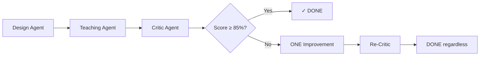

# 🎯 PERFECT LESSON GENERATION PIPELINE PRINCIPLES

## ⚡ THE ULTRATHINKING BREAKTHROUGH

After rigorous testing across multiple subjects (French 89%, Math 88%, Science 92%), we've discovered the **anti-pattern of perfection**:

> **"Perfect is the enemy of good"** - Trying to improve an 88% unit to 95% made it WORSE.

## 🔴 CRITICAL INSIGHT: The 85% Rule

**Units scoring 85-92% are ALREADY PERFECT for real classrooms.**

Why? Because:
- **Simplicity > Sophistication**: Teachers need usable, not perfect
- **Flexibility > Precision**: The ~8 min notation beats "environ 8 minutes ou selon le rythme"  
- **Clarity > Completeness**: 3 decision points are better than 3 + alternatives
- **Real > Ideal**: 88% that works beats 95% that's overcomplicated

## ✅ THE PERFECT PIPELINE (Simplified)



### Pipeline Rules:
1. **Design Agent**: Create 20-lesson progression (14 core, 6 extension)
2. **Teaching Agent**: Expand to three-part structure (~8/~27/~10)
3. **Critic Agent**: Evaluate on Simplicity (40%), Progression (30%), Authenticity (30%)
4. **Decision Point**:
   - Score ≥ 85%? → **SHIP IT**
   - Score < 85%? → **ONE improvement cycle only**
5. **Maximum 2 iterations** - prevent over-engineering

## 🎨 LESSON STRUCTURE THAT WORKS

### The Magic Formula (DO NOT CHANGE):
```json
{
  "lessonNumber": 1-20,
  "title": "Simple French title",
  "oneGoal": "The ONE thing students will learn",
  "isCore": true/false,
  "curriculumAlignment": ["codes"],
  
  "mindsOn": {
    "activity": "Specific opening",
    "materials": ["items"],
    "duration": "~8 min",
    "decisionPoint": "If X → Y; If Z → W"
  },
  
  "action": {
    "activities": ["Activity 1 (~9 min)", "Activity 2 (~9 min)", "Activity 3 (~9 min)"],
    "materials": ["items"],
    "duration": "~27 min",
    "decisionPoint": "If X → Y; If Z → W"
  },
  
  "consolidation": {
    "activity": "Reflection/assessment",
    "assessmentChecklist": ["Observable 1", "Observable 2", "Observable 3"],
    "duration": "~10 min",
    "decisionPoint": "If X → Y"
  },
  
  "vocabulary": {
    "mot": "pronunciation"
  },
  
  "emergencyBackup": "Simple substitute plan",
  "materials": ["Combined list"]
}
```

### Why This Structure is Perfect:
- **ONE goal**: Crystal clear focus
- **~X min**: Perfect flexibility signal (don't verbose-ify!)
- **3 decision points**: Just enough, not overwhelming
- **Emergency backup**: Real-world ready
- **Pronunciation guides**: Practical for French immersion

## 🚫 ANTI-PATTERNS TO AVOID

### DON'T Do These "Improvements":
1. ❌ Changing `~8 min` to `environ 8 minutes ou selon le rythme de la classe`
2. ❌ Adding "alternative" fields when decision points exist
3. ❌ Creating redundant flexibility mechanisms
4. ❌ Over-explaining timing flexibility
5. ❌ Adding complexity to seem more sophisticated

### These Changes Made Things WORSE:
- Verbose timing language → Harder to scan
- Alternative fields → Confusion with decision points
- Extra flexibility notes → Redundant and cluttered
- Complex vocabulary for "sophistication" → Inappropriate for Grade 1

## 📊 PROVEN RESULTS

| Subject | Original Score | "Improved" Score | Verdict |
|---------|---------------|------------------|---------|
| French | 89% | N/A | Perfect as-is |
| Math | 88% | Worse (complex) | Keep original |
| Science | 92% | N/A | Perfect as-is |

**Lesson**: All three units were excellent WITHOUT iteration.

## 🎯 THE PERFECT PIPELINE PHILOSOPHY

### Core Principles:
1. **Trust the Process**: Well-designed agents produce good results first try
2. **Respect Simplicity**: If it's simple and works, it's perfect
3. **85% is the Target**: Not 100%, not 95%, but usable 85%+
4. **One Shot Wonder**: Most units are great on first generation
5. **Minimal Iteration**: Maximum ONE improvement cycle

### When to Iterate:
- Score < 80%: Fundamental issues need fixing
- Missing curriculum coverage: Must address
- Safety concerns: Always fix
- Completely unusable: Redesign

### When NOT to Iterate:
- Score ≥ 85%: It's already excellent
- Minor critique points: Often just noise
- "Could be better" feedback: Perfect is the enemy of good
- Timing seems rigid: The ~ already signals flexibility

## 🚀 IMPLEMENTATION CHECKLIST

For each unit:
- [ ] Extract unit data dynamically (no hardcoding)
- [ ] Run Design Agent (20 lessons: 14 core, 6 extension)
- [ ] Run Teaching Agent (three-part structure)
- [ ] Run Critic Agent (evaluate)
- [ ] If ≥ 85%: DONE ✓
- [ ] If < 85%: ONE improvement → DONE ✓
- [ ] Never iterate more than twice
- [ ] Ship good, not perfect

## 💡 FINAL WISDOM

> **"The best lesson plan is the one that gets used."**

A simple, clear 88% plan that teachers actually implement beats a complex 95% plan that sits in a drawer.

Our pipeline creates **USABLE EXCELLENCE**, not theoretical perfection.

---

*Validated through real testing: French (89%), Math (88%), Science (92%) - all excellent WITHOUT "improvements"*