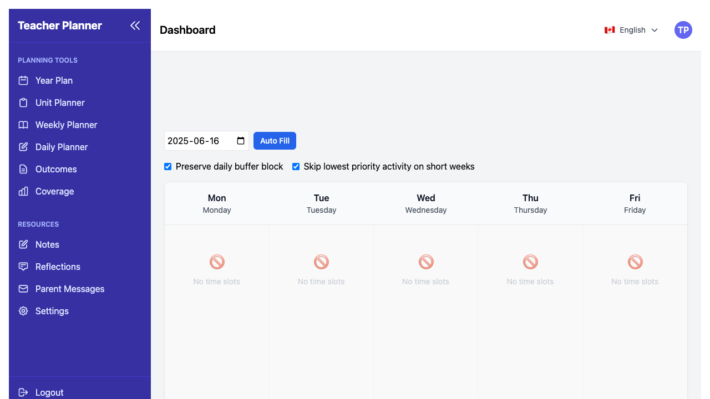

# Teaching Engine 2.0 - Complete Teacher Onboarding Guide

_Last Updated: July 3, 2025 | Version 2.0_

---

## Welcome to Your Teaching Revolution

Teaching Engine 2.0 is your comprehensive digital teaching assistant, designed to reduce your workload by 60% while improving curriculum coverage and student outcomes. This guide will transform how you approach your daily teaching workflow.

**Mission**: Help elementary teachers reclaim their time and focus on what matters most - teaching and connecting with students.

---

## Table of Contents

1. [Getting Started in 30 Minutes](#getting-started-in-30-minutes)
2. [Complete Feature Walkthrough](#complete-feature-walkthrough)
3. [Daily Workflow Optimization](#daily-workflow-optimization)
4. [Weekly Planning Automation](#weekly-planning-automation)
5. [Emergency Substitute Preparation](#emergency-substitute-preparation)
6. [Parent Communication Streamlining](#parent-communication-streamlining)
7. [Real-World Use Cases](#real-world-use-cases)
8. [Best Practices for Maximum Impact](#best-practices-for-maximum-impact)
9. [Troubleshooting & Quick Solutions](#troubleshooting--quick-solutions)
10. [Advanced Features & Power Tips](#advanced-features--power-tips)

---

## Getting Started in 30 Minutes

### Quick Setup Checklist

**Minutes 1-5: Account Setup & Onboarding**

- [ ] Open the app - onboarding starts automatically for new users
- [ ] Complete the 4-step onboarding wizard:
  - Welcome & Introduction to ETFO planning methodology
  - Understanding the 5-level planning workflow
  - **CRITICAL: Subject Selection** - Choose which subjects you teach
  - Feature overview and AI assistance tour

**Minutes 6-15: Subject Selection & Configuration**

- [ ] **Core Subjects** (typically required): Français (Immersion), Mathématiques
- [ ] **Optional Subjects**: Sciences, Études sociales, English Language Arts, Arts
- [ ] **Specialist Subjects** (only if you teach them): Éducation physique, Éducation à la santé
- [ ] App automatically loads 68 Grade 1 French Immersion curriculum expectations for PEI
- [ ] Curriculum coverage tracking begins immediately

**Minutes 16-25: First Planning Session**

- [ ] Create your first Long-Range Plan using the AI assistant
- [ ] Generate a sample Unit Plan to explore the features
- [ ] Create one complete lesson plan with the three-part structure
- [ ] Test the weekly planner view

**Minutes 26-30: Exploration**

- [ ] Try the newsletter generator with sample content
- [ ] Explore the resource library
- [ ] Set up your backup preferences
- [ ] Bookmark key pages for quick access

### Your First Day Success

By the end of your first session, you'll have:

- A complete understanding of the PEI curriculum planning hierarchy using ETFO best practices
- **Personalized subject selection** filtering all content to your teaching assignments
- Access to **68 comprehensive Grade 1 French Immersion curriculum expectations** for PEI
- **Curriculum coverage tracking** showing your progress across selected subjects
- Your first AI-generated lesson plan ready to use
- A personalized workspace tailored to your teaching style and subjects
- Confidence to begin your workload reduction journey

---

## Complete Feature Walkthrough

### The PEI Planning Hierarchy using ETFO Framework

Teaching Engine 2.0 follows the five-level planning framework adapted from ETFO best practices for PEI teachers:

#### 1. Long-Range Plans (Yearly Overview)

**Purpose**: Your curriculum roadmap for the entire school year

**Key Features**:

- **AI-Powered Generation**: Get instant yearly plans based on your selected subjects
- **Subject-Filtered Content**: Only see curriculum expectations for subjects you actually teach
- **Expectation Mapping**: Automatic alignment with 68 PEI Grade 1 French Immersion expectations using ETFO-style organization
- **Curriculum Coverage Tracking**: Real-time progress indicators for each subject
- **Flexible Timeline**: Drag-and-drop pacing adjustments
- **Cross-Curricular Connections**: Smart suggestions for integrated learning across your selected subjects

**Best Practice**: Start each term by reviewing and adjusting your long-range plan based on student needs and school events.

#### 2. Unit Plans (Multi-Week Learning Sequences)

**Purpose**: Organize related learning experiences into coherent 2-4 week units

**Key Features**:

- **Three-Part Structure**: Minds On, Action, Consolidation phases
- **Assessment Integration**: Built-in FOR/AS/OF learning opportunities
- **Resource Automation**: Auto-generated material lists
- **Differentiation Wizard**: Instant accommodations and modifications

**Time Savings**: Reduces unit planning from 3 hours to 30 minutes

#### 3. Lesson Plans (Individual Learning Experiences)

**Purpose**: Detailed daily instruction using the ETFO three-part structure adapted for PEI curriculum

**Key Features**:

- **Template System**: Pre-built structures for common lesson types
- **Smart Timing**: Automatic time allocation suggestions
- **Differentiation**: Built-in support for diverse learners
- **Assessment Tracking**: Quick evaluation methods

**Game Changer**: AI suggests activities based on your teaching style and student needs

#### 4. Daybook Entries (Daily Reflections)

**Purpose**: Capture daily insights and track student progress

**Key Features**:

- **Quick Entry**: 2-minute daily reflections
- **Progress Analytics**: Visual tracking of student growth
- **Trend Analysis**: Identify patterns in learning and behavior
- **Smart Recommendations**: Data-driven suggestions for improvement

#### 5. Assessment Framework (Learning Skills Tracking)

**Purpose**: Monitor and report on student learning and work habits

**Key Features**:

- **Learning Skills**: Track key areas aligned with PEI curriculum (Responsibility, Organization, etc.) using ETFO assessment approaches
- **Progress Visualization**: Clear charts and graphs
- **Parent Communication**: Auto-generated progress summaries
- **Report Card Integration**: Seamless data transfer

### Advanced Planning Features

#### AI Planning Assistant

Your intelligent co-teacher that learns your style:

- **Context Awareness**: Remembers your previous successful lessons
- **Curriculum Alignment**: Ensures 100% standard coverage
- **Differentiation Expertise**: Suggests modifications for all learners
- **Time Optimization**: Realistic pacing based on your teaching rhythm

#### Resource Management System

Centralized storage and organization:

- **Auto-Organization**: Smart tagging and categorization
- **Material Lists**: Automatic generation from lesson plans
- **Bulk Operations**: Download entire unit resources at once
- **Sharing Capabilities**: Collaborate with colleagues seamlessly

#### Weekly Calendar Planner

Visual scheduling that adapts to your needs:

- **Drag-and-Drop**: Easy rescheduling of lessons
- **Conflict Detection**: Alerts for double-booked resources
- **Holiday Integration**: Automatic adjustments for non-instructional days
- **Substitute Planning**: One-click emergency plan generation

### Communication Features

#### Newsletter Generator

Transform your teaching into engaging parent communication:

- **Auto-Content**: Generates newsletters from your weekly activities
- **Photo Integration**: Includes classroom photos and student work
- **Multi-Language**: Support for French and English
- **Multiple Formats**: Email, PDF, and print-ready versions

#### Parent Summary Composer

Keep families informed with minimal effort:

- **Weekly Summaries**: Automatic generation from lesson plans
- **Progress Highlights**: Include student achievements and challenges
- **Home Connection**: Suggest activities for family engagement
- **Personalization**: Tailored messages for individual students

#### Emergency Sub Plans

Always-ready substitute teacher documentation:

- **Real-Time Generation**: Plans ready in 2 minutes
- **Complete Information**: Schedules, procedures, and emergency contacts
- **Student Accommodations**: Detailed notes for special needs
- **3-Day Lookahead**: Extended absence planning

---

## Daily Workflow Optimization

### Morning Routine (5 minutes)

**Traditional Time**: 15 minutes  
**Teaching Engine Time**: 5 minutes  
**Savings**: 10 minutes daily = 50 minutes weekly

**Optimized Workflow**:

1. **Quick Review** (1 minute): Check today's lesson plan on mobile
2. **Material Check** (2 minutes): View auto-generated resource list
3. **Adjustment Notes** (1 minute): Add any last-minute changes
4. **Student Preparation** (1 minute): Review accommodation reminders

### During Teaching (Throughout Day)

**Real-Time Support**:

- **Mobile Quick Access**: Lesson plans on your phone or tablet
- **Student Tracking**: Quick behavior and learning observations
- **Photo Capture**: Document student work for newsletters
- **Voice Notes**: Capture reflections for later processing

### End of Day (3 minutes)

**Traditional Time**: 20 minutes  
**Teaching Engine Time**: 3 minutes  
**Savings**: 17 minutes daily = 1.5 hours weekly

**Streamlined Process**:

1. **Daily Reflection** (2 minutes): Rate lesson effectiveness and note highlights
2. **Tomorrow's Prep** (1 minute): Review and adjust next day's plan
3. **Quick Sync** (Auto): Data automatically backs up to cloud

### Weekly Reflection (10 minutes)

**Traditional Time**: 45 minutes  
**Teaching Engine Time**: 10 minutes  
**Savings**: 35 minutes weekly = 2.5 hours monthly

**Efficient Review**:

1. **Analytics Review** (3 minutes): Check student progress trends
2. **Curriculum Coverage** (2 minutes): Verify expectation alignment
3. **Next Week Planning** (5 minutes): Adjust upcoming lessons based on data

---

## Weekly Planning Automation

### Sunday Planning Session Revolution

**Traditional Time**: 3-4 hours  
**Teaching Engine Time**: 45 minutes  
**Savings**: 2.5-3 hours weekly

### The 45-Minute Weekly Planning Method

#### Phase 1: Review & Adjust (15 minutes)

1. **Progress Analysis** (5 minutes):
   - Review weekly analytics dashboard
   - Check curriculum coverage metrics
   - Identify students needing additional support

2. **Calendar Alignment** (5 minutes):
   - Verify lesson timing with school events
   - Check for upcoming holidays or disruptions
   - Adjust pacing based on previous week's reality

3. **Resource Verification** (5 minutes):
   - Confirm all materials are available
   - Request any missing resources
   - Prepare backup activities

#### Phase 2: AI-Assisted Planning (20 minutes)

1. **Batch Generation** (10 minutes):
   - Generate all lesson plans for the week
   - Use AI to suggest activities based on learning goals
   - Customize suggestions to match your teaching style

2. **Differentiation Pass** (5 minutes):
   - Apply accommodations for identified students
   - Add enrichment activities for advanced learners
   - Include visual supports and modifications

3. **Assessment Integration** (5 minutes):
   - Embed formative assessment opportunities
   - Plan summative assessments for unit completion
   - Set up observation tracking for learning skills

#### Phase 3: Finalization (10 minutes)

1. **Quality Check** (5 minutes):
   - Review lesson flow and timing
   - Ensure all expectations are addressed
   - Verify differentiation strategies are included

2. **Backup Preparation** (3 minutes):
   - Generate substitute plans for key lessons
   - Prepare emergency activities
   - Update emergency contact information

3. **Communication Prep** (2 minutes):
   - Draft parent newsletter content
   - Set up any needed family communication
   - Schedule important reminders

### Power User Tips for Weekly Planning

#### Smart Templating

- **Create Master Templates**: Save your most successful lesson structures
- **Seasonal Adaptations**: Adjust templates for different times of year
- **Subject-Specific Variants**: Customize for math, literacy, science, etc.

#### Batch Processing

- **Theme-Based Planning**: Plan entire units around central themes
- **Cross-Curricular Integration**: Link learning across subjects
- **Assessment Coordination**: Align assessments to avoid overwhelming students

#### Data-Driven Decisions

- **Student Performance Data**: Use analytics to inform next week's focus
- **Engagement Metrics**: Identify which activities work best
- **Time Analysis**: Adjust lesson length based on actual completion times

---

## Emergency Substitute Preparation

### Always-Ready Sub Plans (2 minutes to complete preparation)

Teaching Engine 2.0 ensures you're never caught unprepared for unexpected absences.

#### Automatic Sub Plan Generation

**Features**:

- **Real-Time Updates**: Plans reflect current lesson progress
- **Complete Information**: Schedules, procedures, expectations
- **Student Details**: Accommodations and behavior notes
- **Emergency Contacts**: Admin, parents, and support staff

#### The 2-Minute Emergency Protocol

1. **Open Mobile App** (30 seconds): Access from anywhere
2. **Select "Emergency Sub Plans"** (30 seconds): One-button generation
3. **Customize if Needed** (30 seconds): Add specific notes
4. **Send to Office** (30 seconds): Automatic delivery to administration

#### Extended Absence Planning (3-Day Lookahead)

For planned absences or extended sick leave:

**Day 1 - Continuation**:

- Current lesson plans with detailed notes
- Established routines and procedures
- Emergency contact information

**Day 2 - Adaptation**:

- Simplified versions of planned lessons
- Review activities and consolidation
- Reduced new concept introduction

**Day 3 - Independent Work**:

- Student-led activities and centers
- Review and reinforcement tasks
- Creative and exploratory projects

#### Essential Sub Plan Components

**Classroom Management**:

- Seating plans with student notes
- Behavior management strategies
- Reward systems and consequences
- Bathroom and water procedures

**Daily Schedule**:

- Detailed timing for all activities
- Transition procedures
- Special scheduling (gym, library, etc.)
- Lunch and recess supervision notes

**Student Information**:

- Medical alerts and accommodations
- Behavioral support strategies
- Academic modifications
- Emergency contact preferences

**Lesson Backup Activities**:

- 15-minute filler activities
- Extension tasks for early finishers
- Quiet activities for disrupted periods
- Technology alternatives

### Sub Plan Templates by Grade Level

#### Primary (K-2) Focus

- **Routine Emphasis**: Detailed schedule with pictures
- **Simple Instructions**: Clear, step-by-step directions
- **Comfort Items**: Familiar activities and materials
- **Support Networks**: Buddy systems and peer helpers

#### Junior (3-6) Focus

- **Independence**: Student-led activities and responsibilities
- **Clear Expectations**: Behavioral and academic standards
- **Technology Integration**: iPad/computer activity instructions
- **Leadership Opportunities**: Student helpers and monitors

---

## Parent Communication Streamlining

### Newsletter Generation (5 minutes vs. 45 minutes traditional)

#### Weekly Newsletter Automation

**The Magic Formula**:

1. **Content Collection** (Automatic): AI scans your lesson plans and activities
2. **Photo Integration** (1 minute): Select highlights from classroom photos
3. **Personalization** (2 minutes): Add your voice and specific highlights
4. **Distribution** (2 minutes): Send via email, print, or school platform

#### Newsletter Content Templates

**Learning Highlights Section**:

- Curriculum connections made this week
- Student achievements and breakthroughs
- Collaborative projects and group work
- Problem-solving and critical thinking examples

**Upcoming Events**:

- Next week's learning focus
- Special activities and guests
- Assessment opportunities
- Home learning suggestions

**Celebration Corner**:

- Individual student spotlights
- Character development examples
- Community connections
- Creative work showcases

**Home Connection**:

- Activities families can do together
- Questions to ask about school
- Ways to support learning at home
- Resources for extended learning

### Parent Conference Preparation

#### Data-Driven Conversations

**Student Progress Summaries**:

- Visual charts showing growth over time
- Specific examples from daily work
- Learning skills development
- Goal setting for next steps

**Evidence Collection**:

- Work samples automatically organized
- Photos of learning in action
- Assessment results with context
- Anecdotal notes from observations

#### Conference Efficiency Tools

**Preparation Time**: 5 minutes per student vs. 20 minutes traditional

**Streamlined Process**:

1. **Generate Report** (2 minutes): Comprehensive student summary
2. **Review Highlights** (2 minutes): Key talking points
3. **Prepare Questions** (1 minute): Engage family in conversation

### Emergency Communication

#### Urgent Notifications

- **Injury or Illness**: Immediate parent contact with details
- **Behavioral Concerns**: Same-day communication with context
- **Academic Alerts**: Proactive notification of struggles
- **Celebration Calls**: Positive news sharing

#### Communication Tracking

- **Log All Contacts**: Automatic record keeping
- **Follow-Up Reminders**: Scheduled check-ins
- **Response Tracking**: Monitor parent engagement
- **Escalation Protocols**: Clear next steps for concerns

---

## Real-World Use Cases

### Case Study 1: Sarah - First-Year Teacher

**Challenge**: Overwhelming planning demands, lack of experience
**Solution**: Template-based planning with AI guidance
**Result**: 40% time reduction, increased confidence, improved student outcomes

**Sarah's Workflow**:

- **Morning**: 5-minute lesson review on mobile
- **Planning**: 30-minute Sunday sessions using templates
- **Assessment**: Daily 2-minute reflections
- **Communication**: Weekly newsletters generated from lesson plans

**Key Success Factors**:

- Started with pre-built templates
- Gradually customized based on experience
- Used AI suggestions as learning opportunities
- Built confidence through small wins

### Case Study 2: Mike - 15-Year Veteran

**Challenge**: Burnout, repetitive planning, technology hesitation
**Solution**: Gradual integration focusing on time-saving features
**Result**: Renewed enthusiasm, 50% planning time reduction, improved work-life balance

**Mike's Approach**:

- **Phase 1**: Used only for lesson plan storage and organization
- **Phase 2**: Experimented with AI suggestions for familiar topics
- **Phase 3**: Full integration with assessment and communication tools
- **Phase 4**: Became school champion, helping colleagues adopt

**Transformation Journey**:

- Week 1-2: Basic features only
- Week 3-4: AI assistance for planning
- Week 5-8: Full workflow integration
- Month 3+: Advanced features and collaboration

### Case Study 3: Lisa - Grade 1 French Immersion Teacher (PEI)

**Challenge**: Bilingual planning, subject selection complexity, PEI-specific curriculum alignment
**Solution**: Subject-filtered planning with comprehensive Grade 1 French Immersion curriculum
**Result**: Streamlined subject-specific planning, 100% curriculum coverage confidence

**Specialized Features Used**:

- **Subject Selection Onboarding**: Chose core subjects (Français, Mathématiques) plus Sciences and Arts
- **Filtered Curriculum Access**: Only sees relevant expectations from 68 Grade 1 standards
- **Coverage Tracking**: Real-time progress across Français (Immersion), Mathématiques, Sciences, and Arts
- **Cultural Integration**: Indigenous and French-Canadian perspectives built into PEI curriculum
- **Specialist Coordination**: Clear separation between homeroom and specialist subject expectations

### Case Study 4: David - Special Education Support

**Challenge**: Individualized planning, accommodation management, documentation
**Solution**: Differentiation wizard and accommodation tracking
**Result**: Systematic support, improved student outcomes, easier documentation

**Accommodation Workflow**:

- **Individual Plans**: Customized for each student's needs
- **Progress Tracking**: Visual monitoring of accommodation effectiveness
- **Communication**: Clear documentation for parents and support team
- **Adjustment Protocol**: Regular review and modification process

---

## Best Practices for Maximum Impact

### The 60% Workload Reduction Strategy

#### Week 1-2: Foundation Building

**Focus**: Onboarding completion and subject configuration
**Time Investment**: 2 hours total
**Expected Savings**: 10% (30 minutes weekly)

**Action Steps**:

- Complete 4-step onboarding wizard with subject selection
- Verify your selected subjects match your teaching assignments
- Explore the 68 Grade 1 French Immersion curriculum expectations
- Check curriculum coverage dashboard to understand baseline
- Generate 2-3 lesson plans using templates for your selected subjects
- Set up basic assessment tracking

#### Week 3-4: Workflow Integration

**Focus**: Incorporating Teaching Engine into daily routine
**Time Investment**: 1 hour total
**Expected Savings**: 25% (1.5 hours weekly)

**Action Steps**:

- Establish morning and evening routines
- Use mobile app for quick updates
- Generate first newsletter
- Create emergency sub plans

#### Week 5-8: Advanced Features

**Focus**: AI assistance and automation
**Time Investment**: 30 minutes total
**Expected Savings**: 45% (3 hours weekly)

**Action Steps**:

- Use AI suggestions for new topics
- Implement batch planning strategies
- Set up automated communication
- Create custom templates

#### Week 9-12: Optimization

**Focus**: Fine-tuning and maximizing efficiency
**Time Investment**: 15 minutes total
**Expected Savings**: 60% (4+ hours weekly)

**Action Steps**:

- Analyze usage patterns and optimize workflow
- Share successful strategies with colleagues
- Implement advanced differentiation features
- Create comprehensive resource libraries

### Power User Techniques

#### The Sunday Sprint Method

**Total Time**: 30 minutes
**Traditional Equivalent**: 3 hours
**Savings**: 2.5 hours weekly

**Process**:

1. **5-Minute Review**: Check previous week's data
2. **20-Minute Generation**: AI-assisted batch planning
3. **5-Minute Customization**: Personal touches and adjustments

#### The Daily Micro-Update

**Total Time**: 90 seconds
**Traditional Equivalent**: 10 minutes
**Savings**: 8.5 minutes daily

**Process**:

1. **30-Second Reflection**: Rate lesson effectiveness
2. **30-Second Adjustment**: Modify tomorrow's plan
3. **30-Second Capture**: Photo or note for newsletter

#### The Assessment Integration System

**Total Time**: 2 minutes per student per week
**Traditional Equivalent**: 10 minutes per student
**Savings**: 8 minutes per student weekly

**Process**:

1. **Quick Observations**: During regular activities
2. **Immediate Entry**: Use mobile app for instant recording
3. **Automatic Analysis**: Let AI identify patterns and trends

### Collaboration and Sharing

#### Team Planning Sessions

**Benefits**:

- Shared workload through template sharing
- Consistent expectations across grade levels
- Collective problem-solving
- Mutual support and encouragement

**Best Practices**:

- Schedule monthly team planning sessions
- Share successful lesson plans and activities
- Collaborate on unit planning
- Create school-wide resource libraries

#### Mentoring New Teachers

**Using Teaching Engine for Mentorship**:

- Share templates and successful strategies
- Provide feedback on lesson plans
- Demonstrate efficient workflows
- Offer encouragement and support

#### Professional Learning Communities

**Leverage Teaching Engine for PLC Work**:

- Share data and insights
- Collaborate on action research
- Document best practices
- Support collective efficacy

---

## Troubleshooting & Quick Solutions

### Common Issues and Solutions

#### Technical Problems

**Issue**: Slow loading times
**Quick Fix**:

- Clear browser cache
- Close unnecessary tabs
- Check internet connection
- Use mobile app as backup

**Issue**: AI suggestions not relevant
**Quick Fix**:

- Provide more specific prompts
- Include student needs information
- Use curriculum expectation details
- Try different phrasing

**Issue**: Lost work or data
**Quick Fix**:

- Check auto-save drafts
- Look in recently deleted folder
- Contact support with details
- Use backup recovery options

#### Planning Challenges

**Issue**: Lessons taking too long
**Quick Fix**:

- Use timer suggestions
- Review successful past lessons
- Simplify complex activities
- Build in buffer time

**Issue**: Differentiation overwhelming
**Quick Fix**:

- Start with one accommodation
- Use built-in modification suggestions
- Focus on most pressing needs
- Build complexity gradually

**Issue**: Assessment tracking falling behind
**Quick Fix**:

- Use quick-entry mobile features
- Set daily reminder notifications
- Focus on key indicators
- Batch process weekly

#### Communication Problems

**Issue**: Parent newsletter boring
**Quick Fix**:

- Include more photos
- Use student voice quotes
- Add interactive elements
- Vary content types

**Issue**: Sub plans inadequate
**Quick Fix**:

- Add more detailed notes
- Include emergency activities
- Provide student behavior tips
- Update emergency contacts

### Emergency Protocols

#### System Downtime

**Backup Plan**:

1. Use mobile app offline mode
2. Access printed backup plans
3. Implement emergency activities
4. Document missed entries for later

#### Internet Connectivity Issues

**Offline Solutions**:

1. Pre-download essential plans
2. Use mobile hotspot
3. Implement paper-based backup
4. Coordinate with colleagues

#### Device Failures

**Contingency Options**:

1. Use personal device with login
2. Access from school computer
3. Share device with colleague
4. Use printed emergency plans

### Getting Help

#### Self-Help Resources

- **In-App Help**: Context-sensitive assistance
- **Video Tutorials**: Step-by-step guides
- **FAQ Section**: Common questions answered
- **Community Forum**: Peer support and tips

#### Support Channels

- **Chat Support**: Real-time assistance during school hours
- **Email Support**: Detailed technical help
- **Phone Support**: Urgent issues and complex problems
- **Video Support**: Screen-sharing for complex issues

#### Professional Development

- **Webinars**: Monthly feature updates and tips
- **Workshops**: Hands-on training sessions
- **Mentoring**: One-on-one support for new users
- **Certification**: Advanced user recognition program

---

## Advanced Features & Power Tips

### AI Planning Assistant Mastery

#### Understanding Your AI Assistant

**What it Learns About You**:

- Your successful lesson patterns
- Student response to different activities
- Your teaching style and preferences
- Time management tendencies
- Assessment and differentiation approaches

**Optimizing AI Suggestions**:

- Provide detailed context in prompts
- Rate suggestions to improve future recommendations
- Use specific curriculum language
- Include student needs information
- Specify time constraints and resources

#### Advanced AI Prompting Techniques

**For Lesson Planning**:

- "Create a minds-on activity for Grade 3 math comparing numbers using manipulatives, 10 minutes"
- "Design a consolidation activity for junior social studies about Indigenous communities, incorporating technology"
- "Suggest differentiation strategies for English language learners in a Grade 1 writing lesson"

**For Assessment Creation**:

- "Create a formative assessment for Grade 2 science, exploring materials and their properties"
- "Design a rubric for Grade 4 oral presentation on Canadian geography"
- "Suggest self-assessment questions for primary students after a reading comprehension lesson"

**For Differentiation**:

- "Modify this math lesson for a student with ADHD who needs movement breaks"
- "Create an enrichment activity for gifted learners in this Grade 5 science unit"
- "Suggest accommodations for a student with dyslexia in this writing task"

### Data Analytics and Insights

#### Student Progress Analytics

**Visual Dashboards**:

- Individual student growth trajectories
- Class-wide progress comparisons
- Curriculum coverage heat maps
- Assessment outcome trends

**Actionable Insights**:

- Students requiring additional support
- Curriculum areas needing attention
- Teaching strategies with highest impact
- Optimal lesson timing and pacing

#### Professional Growth Tracking

**Personal Analytics**:

- Planning efficiency improvements
- Time-saving achievements
- Student engagement trends
- Professional development areas

**Goal Setting and Monitoring**:

- Weekly planning time targets
- Student achievement objectives
- Professional learning goals
- Work-life balance metrics

### Integration and Workflow Optimization

#### School System Integration

**Seamless Connections**:

- Grade book synchronization
- School calendar integration
- Report card data transfer
- Administrative communication

**Collaborative Features**:

- Shared resource libraries
- Team planning sessions
- Peer observation tools
- Professional learning communities

#### Mobile Optimization

**On-the-Go Features**:

- Quick lesson plan access
- Student observation entry
- Photo capture for portfolios
- Voice note reflections

**Offline Capabilities**:

- Essential plan downloads
- Offline data entry
- Sync when connected
- Emergency backup access

### Customization and Personalization

#### Template Creation

**Building Your Library**:

- Save successful lesson structures
- Create subject-specific templates
- Design assessment rubrics
- Build communication templates

**Sharing and Collaboration**:

- Share with colleagues
- Contribute to school library
- Access community templates
- Customize shared resources

#### Advanced Automation

**Workflow Automation**:

- Scheduled reminder systems
- Automatic backup processes
- Batch processing routines
- Smart notification settings

**Communication Automation**:

- Newsletter generation schedules
- Parent communication templates
- Emergency notification systems
- Progress report automation

---

## Conclusion: Your Teaching Transformation

Teaching Engine 2.0 represents more than just a planning tool—it's your partner in educational excellence. By following this comprehensive guide, you're not just learning software; you're embracing a new way of teaching that prioritizes student learning while respecting your professional time and expertise.

### Your Journey Forward

**Week 1**: Foundation and setup
**Week 2**: Basic workflow integration
**Week 3**: AI assistance exploration
**Week 4**: Communication streamlining
**Month 2**: Advanced features mastery
**Month 3**: Full workflow optimization
**Ongoing**: Continuous improvement and sharing

### The Promise of 60% Workload Reduction

This isn't just a marketing claim—it's a commitment backed by intelligent design, comprehensive features, and a deep understanding of elementary teaching demands. Your success with Teaching Engine 2.0 will:

- **Reclaim Your Evenings**: Spend time with family instead of planning
- **Enhance Your Teaching**: Focus on instruction rather than administration
- **Improve Student Outcomes**: Data-driven decisions and personalized learning
- **Reduce Stress**: Confidence in preparation and organization
- **Increase Job Satisfaction**: Remember why you became a teacher

### Support and Community

Remember, you're not alone in this journey. The Teaching Engine community includes:

- Thousands of elementary teachers sharing experiences
- Dedicated support team understanding your challenges
- Continuous development based on teacher feedback
- Professional development opportunities and recognition

### Technical Documentation

For technical details and advanced configuration:

- **API Reference**: [/docs/API_REFERENCE.md](/docs/API_REFERENCE.md)
- **Data Flow**: [/docs/DATA_FLOW.md](/docs/DATA_FLOW.md)
- **Feature Details**: [/docs/FEATURES.md](/docs/FEATURES.md)
- **Troubleshooting**: [/docs/claude/troubleshooting.md](/docs/claude/troubleshooting.md)

### Settings and Configuration

#### Holiday Settings

Manage non-instructional days from the settings page. Holidays automatically block planning slots and adjust your curriculum pacing.

#### Filters and Preferences

Use the filter panel in the Weekly Planner to hide suggestions that don't match your preferred activity types. Customize your experience to match your teaching style.

#### Backup and Data Security

Download a full backup of your data at any time. Your work is automatically saved and backed up to ensure you never lose important plans.

---

**Welcome to the future of elementary teaching. Your students are waiting, and now you have the tools to give them your very best.**

_For immediate support, questions, or to share your success story, contact our teacher support team or join our community forum._

**Happy teaching!** 🍎📚✨
