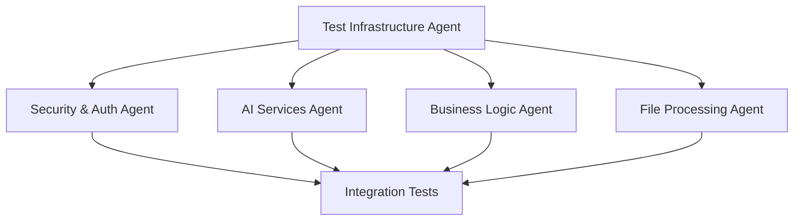

# Multi-Agent Test Coverage Improvement Plan

**Last Updated**: 2025-07-03  
**Goal**: Accelerate test coverage from 62% to 90% using parallel AI agents  
**Timeline**: 3 weeks with 5 parallel agents (vs 8-10 weeks sequential)

## Executive Summary

By deploying multiple specialized AI coding agents working in parallel, we can reduce the test coverage improvement timeline from 8-10 weeks to 3 weeks. This document outlines the agent coordination strategy, specializations, and communication protocols.

## Agent Team Structure

### 1. Test Infrastructure Agent (TIA)
**Specialization**: Test frameworks, mocks, and utilities  
**Start**: Day 1  
**Dependencies**: None

**Responsibilities**:
- Set up test factories and builders
- Create mock infrastructure for external services
- Establish testing patterns and conventions
- Build shared test utilities

**Initial Tasks**:
```typescript
// Week 1 Deliverables
- /mocks/openai.mock.ts
- /mocks/database.mock.ts
- /factories/userFactory.ts
- /factories/lessonPlanFactory.ts
- /utils/testHelpers.ts
- /utils/asyncTestUtils.ts
```

### 2. Security & Auth Agent (SAA)
**Specialization**: Authentication, authorization, security  
**Start**: Day 1  
**Dependencies**: TIA (for mock infrastructure)

**Responsibilities**:
- Test all authentication flows
- Validate authorization middleware
- Test rate limiting and security features
- Ensure compliance with security standards

**Coverage Targets**:
```
src/middleware/auth.ts: 22% → 95%
src/middleware/rateLimiter.ts: 0% → 90%
src/utils/privacy.ts: 0% → 100%
src/utils/contactValidation.ts: 0% → 95%
```

### 3. AI Services Agent (ASA)
**Specialization**: AI integrations, prompt engineering, LLM testing  
**Start**: Day 2 (after TIA creates mocks)  
**Dependencies**: TIA

**Responsibilities**:
- Test all AI service integrations
- Validate prompt generation
- Test response parsing and error handling
- Monitor token usage and costs

**Coverage Targets**:
```
src/services/ai/: 0% → 85%
- aiService.ts
- lessonGenerationService.ts
- openaiService.ts
- providers/*
```

### 4. Business Logic Agent (BLA)
**Specialization**: Core business services, CRUD operations  
**Start**: Day 1  
**Dependencies**: TIA (for factories)

**Responsibilities**:
- Test all business logic services
- Validate data transformations
- Test complex workflows
- Ensure data integrity

**Coverage Targets**:
```
src/services/: 8% → 90%
- curriculumService.ts: 2% → 90%
- lessonPlanService.ts: 9% → 90%
- studentService.ts: 7% → 90%
- assessmentService.ts: 15% → 90%
```

### 5. File Processing Agent (FPA)
**Specialization**: File parsing, document processing  
**Start**: Day 3  
**Dependencies**: TIA

**Responsibilities**:
- Test all file parsers
- Validate content extraction
- Test large file handling
- Ensure memory efficiency

**Coverage Targets**:
```
src/services/fileParsing/: 0% → 85%
- pdfParser.ts
- docxParser.ts
- csvParser.ts
- textExtractor.ts
```

## Agent Coordination Protocol

### 1. Daily Sync Points
```yaml
morning_sync:
  time: "09:00 UTC"
  duration: "15 minutes"
  agenda:
    - Progress updates
    - Blocker identification
    - Dependency resolution
    - Task reallocation if needed

evening_sync:
  time: "17:00 UTC"
  duration: "10 minutes"
  agenda:
    - Daily achievements
    - Next day planning
    - Handoff preparation
```

### 2. Communication Channels

#### Shared State Management
```typescript
// shared/agentState.ts
interface AgentState {
  agent: string;
  status: 'working' | 'blocked' | 'completed';
  currentFiles: string[];
  completedFiles: string[];
  blockers: string[];
  dependencies: {
    needs: string[];
    provides: string[];
  };
}

// State updates via Git commits
// Commit message format: "[AGENT-ID] Status: message"
// Examples:
// "[TIA] Status: Completed mock infrastructure for OpenAI"
// "[SAA] Blocked: Need JWT mock from TIA"
```

#### Dependency Graph


### 3. Conflict Resolution

#### File Lock Protocol
```bash
# Before editing a file, agent checks lock
cat .agent-locks/filename.lock

# If unlocked, agent claims it
echo "AGENT-ID:timestamp" > .agent-locks/filename.lock

# After completion
rm .agent-locks/filename.lock
```

#### Merge Conflict Prevention
```yaml
rules:
  - Each agent works in dedicated feature branch
  - Branch naming: "test/[agent-id]/[feature]"
  - Hourly commits with descriptive messages
  - Daily merge to integration branch
  - Automated conflict detection
```

## Parallel Execution Timeline

### Week 1: Foundation & Core Services

| Day | TIA | SAA | ASA | BLA | FPA |
|-----|-----|-----|-----|-----|-----|
| 1 | Mock infrastructure | Auth middleware tests | - | Basic CRUD tests | - |
| 2 | Test factories | Rate limiter tests | AI mock setup | Service tests | - |
| 3 | Shared utilities | Security utils | Prompt testing | Complex workflows | Parser setup |
| 4 | Database mocks | JWT testing | Response parsing | Data validation | PDF parser |
| 5 | API mocks | Permission tests | Error handling | Transaction tests | DOCX parser |

**Week 1 Target**: 62% → 75% coverage

### Week 2: Advanced Features & Integration

| Day | TIA | SAA | ASA | BLA | FPA |
|-----|-----|-----|-----|-----|-----|
| 6 | Integration helpers | E2E auth flows | Cost tracking | Workflow tests | CSV parser |
| 7 | Performance utils | Security scanning | Prompt variations | Report generation | Large files |
| 8 | - | Session management | Provider switching | Search functionality | Memory tests |
| 9 | - | OAuth integration | Batch processing | Notifications | Content extraction |
| 10 | Code review | Code review | Code review | Code review | Code review |

**Week 2 Target**: 75% → 85% coverage

### Week 3: Edge Cases & Polish

| Day | All Agents |
|-----|------------|
| 11-12 | Integration testing coordination |
| 13-14 | Edge case coverage |
| 15 | Final review and documentation |

**Week 3 Target**: 85% → 90% coverage

## Agent Task Assignment Algorithm

```typescript
interface TaskAssignment {
  agent: string;
  tasks: TestTask[];
  estimatedHours: number;
  dependencies: string[];
}

class TestCoverageCoordinator {
  assignTasks(agents: Agent[], coverageGaps: CoverageGap[]): TaskAssignment[] {
    // Sort by priority and complexity
    const sortedGaps = coverageGaps.sort((a, b) => {
      const priorityDiff = b.priority - a.priority;
      if (priorityDiff !== 0) return priorityDiff;
      return a.complexity - b.complexity;
    });

    // Assign based on specialization match
    const assignments: TaskAssignment[] = [];
    
    for (const gap of sortedGaps) {
      const bestAgent = this.findBestAgent(agents, gap);
      if (bestAgent) {
        assignments.push({
          agent: bestAgent.id,
          tasks: [this.createTestTask(gap)],
          estimatedHours: gap.estimatedHours,
          dependencies: gap.dependencies
        });
      }
    }

    // Balance workload
    return this.balanceWorkload(assignments);
  }

  private findBestAgent(agents: Agent[], gap: CoverageGap): Agent {
    return agents.find(agent => 
      agent.specializations.includes(gap.category) &&
      agent.currentWorkload < agent.capacity
    );
  }
}
```

## Inter-Agent Test Patterns

### 1. Shared Test Utilities
```typescript
// Created by TIA, used by all agents
// shared/testPatterns.ts

export const testCRUD = (serviceName: string, factory: Factory) => {
  describe(`${serviceName} CRUD Operations`, () => {
    generateCreateTests(serviceName, factory);
    generateReadTests(serviceName, factory);
    generateUpdateTests(serviceName, factory);
    generateDeleteTests(serviceName, factory);
  });
};

export const testErrorHandling = (serviceName: string) => {
  describe(`${serviceName} Error Handling`, () => {
    generateValidationTests(serviceName);
    generateTimeoutTests(serviceName);
    generateRetryTests(serviceName);
  });
};
```

### 2. Mock Sharing Protocol
```typescript
// mocks/registry.ts
export const mockRegistry = {
  // TIA registers mocks
  register(name: string, mock: any) {
    registry[name] = mock;
    notifyAgents(`Mock ${name} available`);
  },

  // Other agents consume mocks
  get(name: string): any {
    if (!registry[name]) {
      requestMock(name);
      waitForMock(name);
    }
    return registry[name];
  }
};
```

### 3. Coverage Tracking Dashboard
```yaml
# .coverage-tracking/dashboard.yml
agents:
  TIA:
    assigned_files: 15
    completed: 12
    current_coverage: 85%
    blockers: []
    
  SAA:
    assigned_files: 8
    completed: 6
    current_coverage: 78%
    blockers: ["Waiting for JWT mock"]
    
  ASA:
    assigned_files: 20
    completed: 10
    current_coverage: 45%
    blockers: []

overall:
  total_files: 85
  covered_files: 52
  current_coverage: 71%
  projected_completion: "Day 18"
```

## Quality Gates

### 1. Individual Agent Gates
- No PR without 90% coverage for assigned files
- All tests must pass in <30 seconds
- No flaky tests allowed
- Documentation required for complex tests

### 2. Integration Gates
- Daily integration tests must pass
- No regression in overall coverage
- Performance benchmarks maintained
- Memory usage within limits

### 3. Final Review Gate
- All agents approve integration
- Manual review of critical paths
- Security audit of auth tests
- Performance validation

## Success Metrics

### Velocity Metrics
```yaml
sequential_approach:
  duration: 8-10 weeks
  coverage_per_week: 3.5%
  
parallel_approach:
  duration: 3 weeks
  coverage_per_week: 9.3%
  speedup: 2.7x
```

### Quality Metrics
- Test execution time: <5 minutes
- Test reliability: 100% (no flaky tests)
- Code review time: <2 hours per PR
- Bug discovery rate: >80% before production

## Risk Mitigation

### 1. Agent Failure
- Each agent documents progress daily
- Handoff protocols for agent substitution
- Redundant task assignment for critical paths

### 2. Integration Conflicts
- Automated merge conflict detection
- Dedicated integration agent for week 3
- Rollback procedures for failed merges

### 3. Quality Degradation
- Automated quality checks in CI
- Peer review across agents
- Regular architecture review

## Tooling Requirements

### 1. Agent Coordination Tools
```bash
# Install coordination tools
npm install -D @teaching-engine/agent-coordinator
npm install -D @teaching-engine/coverage-tracker
npm install -D @teaching-engine/conflict-resolver
```

### 2. CI/CD Enhancements
```yaml
# .github/workflows/parallel-testing.yml
name: Parallel Agent Testing
on:
  push:
    branches: [test/*/*)
    
jobs:
  validate-agent-work:
    strategy:
      matrix:
        agent: [TIA, SAA, ASA, BLA, FPA]
    steps:
      - name: Validate ${{ matrix.agent }} tests
        run: |
          npm run test:agent -- --agent=${{ matrix.agent }}
          npm run coverage:check -- --agent=${{ matrix.agent }}
```

### 3. Monitoring Dashboard
```typescript
// Real-time agent monitoring
interface AgentDashboard {
  url: 'http://localhost:3001/agents';
  features: [
    'Real-time coverage tracking',
    'Agent workload visualization',
    'Blocker identification',
    'Progress predictions',
    'Merge conflict alerts'
  ];
}
```

## Conclusion

By utilizing 5 specialized agents working in parallel, we can:
1. Reduce timeline from 8-10 weeks to 3 weeks (70% reduction)
2. Maintain high quality through specialization
3. Minimize conflicts through clear protocols
4. Achieve 90% coverage efficiently

The key to success is:
- Clear specialization boundaries
- Robust communication protocols
- Automated conflict resolution
- Daily synchronization points
- Quality gates at each phase