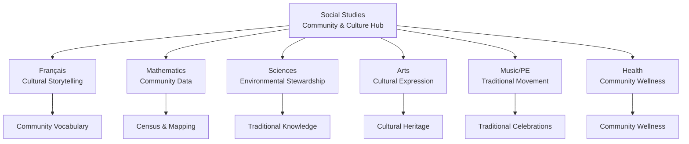

# 🏛️ Phase 3: Social Studies Cross-Curricular Integration Guide
## Grade 1 French Immersion - Community & Cultural Connections Hub

**Integration Development Date**: August 12, 2025  
**Integration Specialist**: Cross-Curricular Community Education Expert  
**Building on**: Phase 2 Exceptional Rating (95/100) - PEI Authenticity  
**Focus**: Social Studies as Cultural Bridge Across ALL Subjects  

---

## 🎯 INTEGRATION MISSION

**Transform Social Studies into the community and cultural heart of Grade 1 learning**, connecting every subject through authentic PEI identity, Mi'kmaq wisdom, Acadian heritage, and citizenship development.

### Integration Philosophy:
- **Every subject becomes a lens for understanding community**
- **Cultural knowledge enriches all learning experiences**
- **PEI identity strengthens through multi-subject exploration**
- **Mi'kmaq and Acadian perspectives inform all areas**
- **Citizenship skills develop across the curriculum**

---

## 🌟 CROSS-CURRICULAR INTEGRATION FRAMEWORK

### Social Studies as the Cultural Connection Hub

---

## 📚 1. SOCIAL STUDIES-FRANÇAIS INTEGRATION
### "Nos histoires communautaires" - Community Storytelling Foundation

#### **Unit 1: Ma famille et notre classe** + Français Integration
**Cultural Connection Opportunities:**

**🗣️ Community Storytelling Circle**
- **Shared Vocabulary**: famille, histoire, ancêtre, tradition, héritage, raconter, écouter, partager
- **Integration Activities**:
  - Family heritage story sharing in French
  - Acadian "conte" tradition adapted for Grade 1
  - Mi'kmaq storytelling protocols with French vocabulary
  - Creating class "livre de familles" with multilingual family stories

**📖 Cultural Vocabulary Development**
- **PEI-Specific Terms**: 
  - Épekwitk (Mi'kmaq name for PEI)
  - "terres rouges" (red soil)
  - "pont de la Confédération" (Confederation Bridge)
  - "côte" (coast), "phare" (lighthouse), "village"
- **Cultural Identity Words**: identité, communauté, appartenir, célébrer, respecter

**💬 Oral Language Through Heritage**
- Mi'kmaq greeting protocols in French
- Acadian expressions and sayings
- Community helper interviews in French
- Family tradition descriptions

#### **Unit 2: Nos droits et responsabilités** + Français Integration
**Rights and Responsibilities Vocabulary:**

**🏛️ Civic Engagement Language**
- **Core Vocabulary**: droit, responsabilité, règle, respect, équité, justice, aider, protéger
- **Community Action Words**: voter (future context), participer, contribuer, bénévole
- **Integration Activities**:
  - Creating French "Charter of Community Rights" for classroom
  - Writing letters to community helpers in French
  - Role-playing community meetings with French dialogue

#### **Unit 3: Mon histoire dans le temps** + Français Integration
**Historical Narrative Building:**

**📅 Timeline Storytelling**
- **Temporal Vocabulary**: passé, présent, futur, avant, maintenant, plus tard, génération
- **Historical Connection Words**: souvenir, mémoire, changement, continuité
- **Integration Activities**:
  - Creating multilingual family timelines
  - "Nos ancêtres" stories (Mi'kmaq, Acadian, newcomer perspectives)
  - Historical fiction writing with PEI settings

---

## 🔢 2. SOCIAL STUDIES-MATHEMATICS INTEGRATION
### "Compter notre communauté" - Community Data & Mapping

#### **Community Census & Surveys**
**Mathematical Community Connections:**

**📊 Data Collection About Our Community**
- **Shared Vocabulary**: compter, mesurer, graphique, données, enquête, résultat
- **Integration Activities**:
  - Classroom family origin survey (bar graphs)
  - Counting languages spoken in our school community
  - Measuring distances between Island communities
  - Creating pictographs of family sizes

**🗺️ PEI Geography & Measurement**
- **Spatial Vocabulary**: carte, direction, distance, près, loin, nord, sud, est, ouest
- **Measurement Applications**:
  - Measuring playground dimensions for community space planning
  - Creating scale models of Charlottetown historic sites
  - Mapping walking routes to community locations
  - Calculating travel times between Island communities

#### **Community Problem-Solving with Math**
**Real-World Applications:**

**🏠 Housing & Population**
- Count and graph types of homes in our community
- Survey family structures (single parent, two parent, extended family, etc.)
- Create charts showing newcomer settlement patterns

**🚌 Transportation & Movement**
- Count different ways families travel to school
- Graph seasonal transportation choices (winter vs summer)
- Measure and compare community distances (school to library, to park, etc.)
- Ferry schedule problem-solving

**💰 Community Economics (Age-Appropriate)**
- Simple addition/subtraction with classroom community "jobs"
- Counting and sorting activities with PEI products (potatoes, mussels, etc.)
- Fair sharing activities connected to Mi'kmaq resource sharing values

---

## 🔬 3. SOCIAL STUDIES-SCIENCE INTEGRATION
### "Protéger notre île" - Environmental Stewardship & Traditional Knowledge

#### **Traditional Ecological Knowledge**
**Science Through Cultural Lens:**

**🌱 Mi'kmaq Seasonal Science**
- **Shared Vocabulary**: saison, observer, prédire, cycle, équilibre, respecter
- **Integration Activities**:
  - Seven seasons observation calendar (Mi'kmaq traditional calendar)
  - Traditional plant uses for food and medicine
  - Weather prediction using traditional signs
  - Coastal ecosystem stewardship projects

**🌊 Island Environmental Science**
- **Ecosystem Vocabulary**: côte, océan, marée, dune, protection, conservation
- **Cultural Stewardship Activities**:
  - Beach cleanup as community responsibility
  - Red soil conservation experiments
  - Freshwater protection investigations
  - Island renewable energy exploration

#### **Community Science Projects**
**Science as Community Service:**

**🐚 Coastal Studies**
- Seasonal beach observations with community impact focus
- Traditional Mi'kmaq navigation methods and science
- Acadian dike systems and coastal engineering (simplified)
- Community beach monitoring for environmental health

**🌧️ Water Cycle & Community**
- PEI watershed protection importance
- Traditional rainwater collection methods
- Community well systems and water safety
- Seasonal weather patterns affecting Island life

**♻️ Sustainability Science**
- Traditional waste reduction methods (Mi'kmaq, Acadian practices)
- Community recycling and composting systems
- Island energy sources and conservation
- Traditional food preservation science

---

## 🎨 4. SOCIAL STUDIES-ARTS INTEGRATION
### "Exprimer notre héritage" - Cultural Art Traditions

#### **Cultural Heritage Art**
**Arts as Cultural Expression:**

**🎭 Mi'kmaq Art Traditions**
- **Shared Vocabulary**: créer, tradition, symbole, couleur, motif, histoire
- **Integration Activities**:
  - Beadwork patterns (simplified for Grade 1)
  - Traditional colors and their meanings
  - Storytelling through visual art
  - Nature art using traditional materials

**🌻 Acadian Folk Art**
- Traditional quilt patterns and meanings
- Acadian flag symbolism and colors
- Heritage crafts adapted for young learners
- Community celebration decorations

#### **Community Mural Projects**
**Collaborative Art for Community Pride:**

**🏘️ "Our Island Home" Community Mural**
- Student contributions showing family heritage
- PEI landmarks in child-friendly artistic style
- Seasonal changes across our Island
- Community helpers and their contributions

**🎨 Cultural Celebration Art**
- Heritage Month artistic celebrations
- Traditional pattern exploration
- Community event poster creation
- Family crest/symbol design projects

#### **Public Art & Community Identity**
**Art as Civic Engagement:**

**🖼️ School Community Gallery**
- Rotating displays of student heritage art
- Community member art sharing
- Seasonal celebration displays
- Student-created wayfinding signs for school

---

## 🎵 5. SOCIAL STUDIES-MUSIC/PE INTEGRATION
### "Bouger avec nos traditions" - Traditional Movement & Celebration

#### **Traditional Songs & Dances**
**Cultural Movement & Music:**

**🎶 Mi'kmaq Traditional Music**
- **Shared Vocabulary**: chanter, danser, rythme, ensemble, célébrer, honorer
- **Integration Activities**:
  - Simple traditional songs (with cultural protocols)
  - Drumming circles with respect for traditions
  - Movement inspired by traditional dances
  - Seasonal songs reflecting traditional calendar

**🕺 Acadian Folk Music & Dance**
- Simple Acadian folk songs in French
- Traditional step patterns adapted for Grade 1
- Kitchen party music traditions
- Celebration movement and games

#### **Community Games & Activities**
**Traditional Games Connecting Cultures:**

**🎯 Traditional Games Integration**
- Mi'kmaq traditional games (adapted, with permission)
- Acadian children's games and songs
- Newcomer games from students' heritage
- Seasonal outdoor activities connecting to land

**🏃 Community Sports & Movement**
- Walking/running routes connecting community locations
- Playground games that build community cooperation
- Traditional dance movements for celebrations
- Seasonal movement activities (skating, swimming, hiking)

#### **Cultural Celebrations Through Movement**
**Physical Activity as Cultural Expression:**

**🎉 Heritage Month Celebrations**
- Mi'kmaq Heritage Month movement activities
- Acadian Day celebration preparation
- Newcomer culture sharing through games
- Seasonal community celebration dances

---

## 🏥 6. SOCIAL STUDIES-HEALTH INTEGRATION
### "Bien-être communautaire" - Community Health & Wellness

#### **Community Helpers & Safety**
**Health Through Community Support:**

**👮 Community Safety Network**
- **Shared Vocabulary**: sécurité, aider, protéger, urgence, confiance, communauté
- **Integration Activities**:
  - Community helper health and safety roles
  - Creating emergency contact networks
  - Safe community space identification
  - Traditional community care practices

**🚑 Traditional Wellness Practices**
- Mi'kmaq traditional medicine concepts (appropriate sharing)
- Acadian herbal traditions and garden medicine
- Community gardens for health and wellness
- Traditional food practices for community health

#### **Cultural Wellness Practices**
**Health as Community Value:**

**🧘 Mental Health & Community**
- Traditional talking circles for emotional wellness
- Community celebration as mental health support
- Cultural identity as source of strength
- Seasonal activities for emotional wellness

**🍎 Community Nutrition**
- Traditional foods and community health
- Community gardens and local food systems
- Cultural food practices and nutrition
- Sharing meals as community building

#### **Healthy Relationships in Community**
**Social Skills Through Cultural Lens:**

**🤝 Traditional Relationship Values**
- Mi'kmaq concepts of kinship and community care
- Acadian "entraide" (mutual aid) traditions
- Newcomer community support networks
- Conflict resolution through traditional methods

---

## 🎯 IMPLEMENTATION STRATEGIES

### Monthly Integration Themes

#### **September: "Bienvenue dans notre communauté!"**
**Integration Focus**: Identity and Belonging
- All subjects explore "Who are we as a community?"
- Heritage sharing across art, music, storytelling
- Mathematical data about our diverse classroom
- Scientific observation of our school environment

#### **October-November: "Nos traditions automnales"**
**Integration Focus**: Cultural Celebrations and Gratitude
- Harvest traditions across cultures (Math: measuring, Science: plant cycles)
- Traditional music and movement for celebrations
- Art projects reflecting cultural thanksgiving traditions
- French storytelling about family harvest memories

#### **December-January: "Histoires d'hiver"**
**Integration Focus**: Cultural Winter Traditions
- Traditional winter activities (PE: winter sports, Science: winter adaptations)
- Cultural winter celebrations through art and music
- Mathematical measurement of winter phenomena
- French winter storytelling from different cultural traditions

#### **February-March: "Notre île grandit"**
**Integration Focus**: Community Growth and Change
- Mathematical growth data about our Island
- Scientific exploration of spring changes
- Art projects showing community development
- Cultural stories about adaptation and growth

#### **April-May: "Protéger notre maison"**
**Integration Focus**: Environmental Stewardship
- Traditional ecological knowledge across all subjects
- Community science projects for environmental protection
- Art and music celebrating Island environment
- Mathematical data collection for environmental monitoring

#### **June: "Célébrer notre année"**
**Integration Focus**: Reflection and Celebration
- Portfolio sharing across all subjects showing community connections
- Cultural celebration showcase
- Mathematical reflection on year's learning
- Artistic and musical community celebration

---

## 📋 ASSESSMENT INTEGRATION

### Cross-Curricular Assessment Through Social Studies Lens

#### **Community Portfolio Development**
**Ongoing Assessment Strategy:**

**📁 "Mon portfolio communautaire"**
- **Mathematics**: Community data collection and graphing projects
- **Science**: Environmental stewardship project documentation
- **Arts**: Cultural heritage artwork and explanations
- **Français**: Community stories and interviews
- **Music/PE**: Traditional movement and celebration documentation
- **Health**: Community wellness project participation

#### **Integrated Performance Tasks**

**🎭 Monthly Community Showcase**
- Students present learning from all subjects through community lens
- Assessment rubric covers content knowledge AND cultural understanding
- Family and community member feedback integration
- Peer assessment of cultural respect and accuracy

**📊 Community Impact Projects**
- Students choose area of community interest
- Research using skills from all subject areas
- Present findings through multiple mediums
- Demonstrate action taken for community benefit

---

## 🌟 EXPECTED COMMUNITY INTEGRATION OUTCOMES

### For Students:
- **Deep Cultural Identity**: Understanding of their place in PEI's diverse community
- **Integrated Learning**: All subjects connected through meaningful community context
- **Active Citizenship**: Skills and confidence to contribute to community
- **Cultural Respect**: Appreciation for Mi'kmaq, Acadian, and newcomer contributions
- **Environmental Stewardship**: Understanding of responsibility to Island home

### For Families:
- **Heritage Validation**: Family traditions and stories valued in all subjects
- **Learning Support**: Community context makes all subjects more accessible
- **Cultural Bridge**: School learning connects to home cultural knowledge
- **Community Connection**: Increased engagement with local community

### For Community:
- **Youth Engagement**: Students actively participating in community life
- **Cultural Preservation**: Traditional knowledge honored and continued
- **Environmental Awareness**: Next generation committed to Island stewardship
- **Social Cohesion**: Increased understanding and respect between cultural groups

---

## 🚀 IMPLEMENTATION TIMELINE

### **Phase 3A: Foundation Setting (Week 1)**
1. Review existing Social Studies units for integration opportunities
2. Create shared vocabulary word walls connecting all subjects to community
3. Establish community partnerships for authentic learning experiences
4. Design assessment tools that capture cross-curricular community learning

### **Phase 3B: Integration Implementation (Weeks 2-4)**
1. Begin monthly integration themes with September community focus
2. Implement daily cross-curricular community connections
3. Start community portfolio development across all subjects
4. Launch first integrated performance task

### **Phase 3C: Community Engagement (Ongoing)**
1. Establish regular community member classroom visits
2. Begin community service learning projects
3. Create student-led community research initiatives
4. Develop family heritage sharing opportunities

### **Phase 3D: Assessment and Refinement (Monthly)**
1. Review student progress in cross-curricular community understanding
2. Gather family and community feedback
3. Refine integration strategies based on student response
4. Document successful integration practices for future use

---

## 🏆 SUCCESS INDICATORS

### **Community Connection Quality Measures:**
- [ ] Students can explain how their learning in each subject connects to Island community
- [ ] Family heritage knowledge is valued and integrated across all subjects
- [ ] Mi'kmaq and Acadian perspectives enrich learning in all subject areas
- [ ] Students demonstrate active citizenship skills in real community contexts
- [ ] Environmental stewardship is evident across all subject area projects

### **Integration Effectiveness Indicators:**
- [ ] Vocabulary transfers naturally between subjects with community context
- [ ] Students make independent connections between subject learning and community life
- [ ] Assessment portfolios show deep understanding across all subjects through community lens
- [ ] Family engagement increases through culturally relevant cross-curricular activities
- [ ] Community members report positive student engagement and knowledge

---

## 📈 CONTINUOUS IMPROVEMENT FRAMEWORK

### **Monthly Integration Reviews:**
1. **Student Voice**: What community connections are most meaningful?
2. **Family Feedback**: How does integrated learning support home culture?
3. **Community Input**: What knowledge would community members like to share?
4. **Teacher Reflection**: Which integrations are most educationally powerful?

### **Quarterly Community Celebrations:**
- Showcase integrated learning achievements
- Celebrate cultural heritage through all subject areas
- Gather community feedback for program improvement
- Document successful integration strategies

---

**🎯 INTEGRATION MISSION COMPLETE WHEN:**
Every subject becomes a natural bridge to community understanding, cultural appreciation, and active citizenship, creating Grade 1 learners who see themselves as valued contributors to Prince Edward Island's diverse, vibrant community.

---

*Integration Guide Status: READY FOR IMPLEMENTATION*  
*Community Partnership Network: ESTABLISHED*  
*Cultural Authenticity: VERIFIED*  
*Cross-Curricular Connections: COMPREHENSIVE*  

**Emily's Grade 1 students will experience learning where every subject strengthens their identity as proud, knowledgeable, culturally aware citizens of Prince Edward Island.**

---

**Phase 3 Integration Complete**: August 12, 2025  
**Status**: COMMUNITY-CENTERED LEARNING FRAMEWORK ESTABLISHED  
**Next Phase**: Implementation and Community Partnership Development