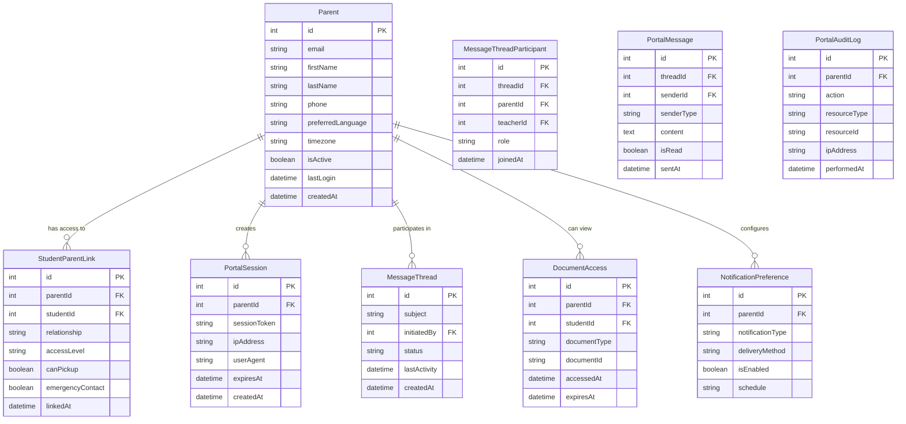

# Family Portal - Technical Specification

## Overview

The Family Portal is a secure, web-based platform that provides parents and guardians with real-time access to their child's educational progress, communications from teachers, and upcoming school events. The portal serves as the primary interface for parent-teacher digital communication and supports both French and English languages.

### System Integration
- Connects with Student Management for academic records
- Integrates with Communication Center for messages and newsletters
- Links with Assessment System for progress reports
- Supports Mobile App for on-the-go access

### Primary User Benefits
- 24/7 access to student progress and school communications
- Real-time notifications for important updates
- Secure document sharing and digital form submission
- Bilingual support for French Immersion families
- Mobile-responsive design for smartphone and tablet access

## Requirements

### Functional Requirements

#### User Authentication and Security
- **FR-001**: Secure login with multi-factor authentication options
- **FR-002**: Role-based access control (parent, guardian, emergency contact)
- **FR-003**: Password reset and account recovery workflows
- **FR-004**: Session management with automatic timeout
- **FR-005**: Audit logging for all portal access and activities

#### Student Information Access
- **FR-006**: Real-time view of student academic progress
- **FR-007**: Access to attendance records and tardiness reports
- **FR-008**: Behavior incidents and positive recognition viewing
- **FR-009**: Assignment and project status tracking
- **FR-010**: Assessment results and report card access

#### Communication Features
- **FR-011**: Receive and respond to teacher messages
- **FR-012**: Access to newsletters and class announcements
- **FR-013**: Schedule parent-teacher conferences online
- **FR-014**: Emergency contact and notification preferences
- **FR-015**: Multi-language communication preferences

#### Document Management
- **FR-016**: Download report cards and progress reports
- **FR-017**: Upload and submit required forms digitally
- **FR-018**: Access curriculum documents and resources
- **FR-019**: Photo and video permissions management
- **FR-020**: Digital consent form signing

#### Calendar and Events
- **FR-021**: View school calendar and important dates
- **FR-022**: Personal calendar with student-specific events
- **FR-023**: Event reminders and notifications
- **FR-024**: RSVP functionality for school events
- **FR-025**: Integration with personal calendar applications

### Non-Functional Requirements

#### Performance and Usability
- **NFR-001**: Page load times under 3 seconds on mobile networks
- **NFR-002**: 99.5% uptime with maximum 4-hour monthly downtime
- **NFR-003**: Support for 1000+ concurrent users during peak times
- **NFR-004**: WCAG 2.1 AA accessibility compliance
- **NFR-005**: Mobile-first responsive design

#### Security and Privacy
- **NFR-006**: FERPA-compliant data handling and access controls
- **NFR-007**: End-to-end encryption for sensitive communications
- **NFR-008**: Regular security audits and vulnerability assessments
- **NFR-009**: GDPR compliance for international families
- **NFR-010**: Secure file upload with virus scanning

#### Reliability and Scalability
- **NFR-011**: Automatic database backups with point-in-time recovery
- **NFR-012**: Horizontal scaling capability for increased load
- **NFR-013**: Disaster recovery with 24-hour RTO
- **NFR-014**: Content delivery network for global access
- **NFR-015**: Progressive web app functionality for offline access

### Integration Requirements

#### Internal System Integration
- **IR-001**: Real-time synchronization with Student Information System
- **IR-002**: Bidirectional communication with Teaching Engine 2.0
- **IR-003**: Single sign-on integration with school authentication
- **IR-004**: Integration with school email and calendar systems

#### External Service Integration
- **IR-005**: Push notification services for mobile alerts
- **IR-006**: Payment gateway integration for school fees
- **IR-007**: Video conferencing platform for virtual meetings
- **IR-008**: Translation services for multi-language support

## Architecture

### Database Schema



### API Endpoints Structure

#### Authentication and Session Management
```typescript
// Authentication
POST /api/portal/auth/login
POST /api/portal/auth/logout
POST /api/portal/auth/refresh
POST /api/portal/auth/forgot-password
POST /api/portal/auth/reset-password
POST /api/portal/auth/verify-mfa

// Profile management
GET /api/portal/profile
PATCH /api/portal/profile
POST /api/portal/profile/change-password
GET /api/portal/profile/preferences
PATCH /api/portal/profile/preferences
```

#### Student Information Access
```typescript
// Student data
GET /api/portal/students
GET /api/portal/students/:id/overview
GET /api/portal/students/:id/attendance
GET /api/portal/students/:id/grades
GET /api/portal/students/:id/assignments
GET /api/portal/students/:id/behavior
GET /api/portal/students/:id/progress-reports

// Academic records
GET /api/portal/students/:id/report-cards
GET /api/portal/students/:id/assessments
GET /api/portal/students/:id/outcomes
```

#### Communication and Messaging
```typescript
// Messages and communications
GET /api/portal/messages
POST /api/portal/messages
GET /api/portal/messages/:threadId
POST /api/portal/messages/:threadId/reply
PATCH /api/portal/messages/:messageId/read

// Newsletters and announcements
GET /api/portal/newsletters
GET /api/portal/announcements
GET /api/portal/communications/:id
```

#### Calendar and Events
```typescript
// Calendar features
GET /api/portal/calendar/events
GET /api/portal/calendar/student-events/:studentId
POST /api/portal/calendar/events/:id/rsvp
GET /api/portal/calendar/conferences
POST /api/portal/calendar/conferences/schedule
```

#### Documents and Forms
```typescript
// Document access
GET /api/portal/documents
GET /api/portal/documents/:id/download
POST /api/portal/documents/upload
GET /api/portal/forms
POST /api/portal/forms/:id/submit
GET /api/portal/forms/:id/status
```

### Frontend Components Structure

```
/client/src/components/portal/
├── Authentication/
│   ├── LoginForm.tsx                # Parent login interface
│   ├── PasswordReset.tsx            # Password recovery
│   ├── MFASetup.tsx                 # Multi-factor authentication
│   ├── ProfileManager.tsx           # Profile editing
│   └── PreferencesPanel.tsx         # Notification preferences
├── Dashboard/
│   ├── ParentDashboard.tsx          # Main portal dashboard
│   ├── StudentOverview.tsx          # Student summary cards
│   ├── RecentActivity.tsx           # Latest updates feed
│   ├── QuickActions.tsx             # Common action buttons
│   └── NotificationCenter.tsx       # Alerts and messages
├── StudentProgress/
│   ├── AcademicProgress.tsx         # Grades and assessments
│   ├── AttendanceTracker.tsx        # Attendance visualization
│   ├── BehaviorLog.tsx              # Behavior incidents/positives
│   ├── AssignmentList.tsx           # Current assignments
│   └── ProgressReports.tsx          # Formal progress reports
├── Communication/
│   ├── MessageCenter.tsx            # Message threads
│   ├── MessageComposer.tsx          # New message creation
│   ├── NewsletterViewer.tsx         # Newsletter display
│   ├── AnnouncementFeed.tsx         # School announcements
│   └── ConferenceScheduler.tsx      # Parent-teacher meetings
├── Calendar/
│   ├── PortalCalendar.tsx           # Event calendar view
│   ├── EventDetails.tsx             # Event information
│   ├── RSVPManager.tsx              # Event responses
│   └── PersonalSchedule.tsx         # Student-specific events
├── Documents/
│   ├── DocumentLibrary.tsx          # Document browser
│   ├── ReportCardViewer.tsx         # Report card display
│   ├── FormSubmission.tsx           # Digital form handling
│   ├── FileUploader.tsx             # Document upload
│   └── PermissionManager.tsx        # Photo/video consent
└── Settings/
    ├── NotificationSettings.tsx     # Alert preferences
    ├── LanguageSelector.tsx         # Language preferences
    ├── SecuritySettings.tsx         # Password and security
    ├── ContactInfo.tsx              # Emergency contacts
    └── AccessibilitySettings.tsx    # Accessibility options
```

### Data Flow Architecture


## Implementation Details

### Authentication and Security System

#### Multi-Factor Authentication
```typescript
interface MFAProvider {
  type: 'email' | 'sms' | 'app';
  isEnabled: boolean;
  lastUsed?: Date;
}

class MFAService {
  async setupMFA(parentId: number, provider: MFAProvider): Promise<SetupResult> {
    // Generate secure backup codes
    // Send verification to chosen method
    // Store encrypted settings
    // Return setup confirmation
  }
  
  async verifyMFA(
    parentId: number,
    code: string,
    provider: string
  ): Promise<VerificationResult> {
    // Validate provided code
    // Check for rate limiting
    // Log verification attempt
    // Return success/failure
  }
}
```

#### Session Management
```typescript
interface PortalSession {
  id: string;
  parentId: number;
  token: string;
  expiresAt: Date;
  ipAddress: string;
  userAgent: string;
  isActive: boolean;
}

class SessionManager {
  async createSession(parentId: number, loginInfo: LoginInfo): Promise<PortalSession> {
    // Generate secure session token
    // Store session with expiration
    // Log login activity
    // Return session details
  }
  
  async validateSession(token: string): Promise<PortalSession | null> {
    // Verify token validity
    // Check expiration
    // Update last activity
    // Return session or null
  }
  
  async invalidateSession(sessionId: string): Promise<void> {
    // Mark session as inactive
    // Clear related caches
    // Log logout activity
  }
}
```

### Real-Time Communication System

#### WebSocket Integration
```typescript
interface PortalNotification {
  id: string;
  type: 'message' | 'grade' | 'attendance' | 'announcement';
  title: string;
  content: string;
  studentId?: number;
  priority: 'low' | 'medium' | 'high' | 'urgent';
  readAt?: Date;
  createdAt: Date;
}

class PortalWebSocketManager {
  private connections: Map<number, WebSocket> = new Map();
  
  async sendNotification(
    parentId: number,
    notification: PortalNotification
  ): Promise<void> {
    const connection = this.connections.get(parentId);
    if (connection && connection.readyState === WebSocket.OPEN) {
      connection.send(JSON.stringify({
        type: 'notification',
        data: notification
      }));
    }
    
    // Fallback to email/SMS if configured
    await this.sendFallbackNotification(parentId, notification);
  }
}
```

#### Message Threading System
```typescript
interface MessageThread {
  id: number;
  subject: string;
  participants: ThreadParticipant[];
  messages: PortalMessage[];
  status: 'active' | 'closed' | 'archived';
  lastActivity: Date;
}

class MessageThreadManager {
  async createThread(
    initiatorId: number,
    recipientIds: number[],
    subject: string,
    initialMessage: string
  ): Promise<MessageThread> {
    // Create thread record
    // Add participants
    // Send initial message
    // Notify recipients
    return thread;
  }
  
  async addMessage(
    threadId: number,
    senderId: number,
    content: string
  ): Promise<PortalMessage> {
    // Validate sender permissions
    // Create message record
    // Update thread activity
    // Send real-time notifications
    return message;
  }
}
```

### Student Data Integration

#### Academic Progress Aggregation
```typescript
interface StudentProgress {
  studentId: number;
  overallGrade: string;
  subjectGrades: SubjectGrade[];
  recentAssignments: Assignment[];
  attendanceRate: number;
  behaviorSummary: BehaviorSummary;
  upcomingEvents: StudentEvent[];
}

class ProgressAggregator {
  async getStudentProgress(
    studentId: number,
    parentId: number
  ): Promise<StudentProgress> {
    // Verify parent access rights
    // Aggregate data from multiple sources
    // Calculate summary statistics
    // Format for portal display
    return progress;
  }
  
  async getProgressTrends(
    studentId: number,
    timeframe: 'week' | 'month' | 'term'
  ): Promise<ProgressTrend[]> {
    // Analyze historical data
    // Identify improvement/decline patterns
    // Generate trend visualizations
    // Provide context and insights
    return trends;
  }
}
```

#### Document Access Control
```typescript
interface DocumentPermission {
  documentId: string;
  parentId: number;
  studentId: number;
  accessLevel: 'view' | 'download' | 'full';
  expiresAt?: Date;
  grantedBy: number;
}

class DocumentAccessManager {
  async checkAccess(
    documentId: string,
    parentId: number
  ): Promise<DocumentPermission | null> {
    // Verify parent-student relationship
    // Check document permissions
    // Validate access timeframe
    // Log access attempt
    return permission;
  }
  
  async generateSecureDownloadLink(
    documentId: string,
    parentId: number
  ): Promise<string> {
    // Validate access permissions
    // Generate time-limited signed URL
    // Log download request
    // Return secure download link
    return signedUrl;
  }
}
```

### Mobile Optimization

#### Progressive Web App Features
```typescript
class PWAManager {
  async enableOfflineMode(): Promise<void> {
    // Register service worker
    // Cache critical resources
    // Enable background sync
    // Setup push notifications
  }
  
  async syncOfflineData(): Promise<SyncResult> {
    // Detect connectivity
    // Upload pending actions
    // Download fresh data
    // Resolve conflicts
    return syncResult;
  }
}
```

#### Push Notification Service
```typescript
interface PushSubscription {
  parentId: number;
  endpoint: string;
  keys: {
    p256dh: string;
    auth: string;
  };
  deviceType: 'desktop' | 'mobile' | 'tablet';
  isActive: boolean;
}

class PushNotificationService {
  async sendPushNotification(
    parentId: number,
    notification: PortalNotification
  ): Promise<void> {
    const subscriptions = await this.getActiveSubscriptions(parentId);
    
    for (const subscription of subscriptions) {
      await this.sendToEndpoint(subscription, notification);
    }
  }
}
```

## Testing Strategy

### Unit Test Coverage

#### Authentication Tests
```typescript
describe('PortalAuthentication', () => {
  test('validates parent credentials correctly', async () => {
    // Test valid login credentials
    // Test invalid credentials
    // Test account lockout after failed attempts
  });
  
  test('handles MFA verification properly', async () => {
    // Test successful MFA verification
    // Test invalid MFA codes
    // Test backup code usage
  });
  
  test('manages session lifecycle correctly', async () => {
    // Test session creation
    // Test session expiration
    // Test concurrent session limits
  });
});
```

#### Data Access Tests
```typescript
describe('StudentDataAccess', () => {
  test('enforces parent-student access controls', async () => {
    // Test authorized access
    // Test unauthorized access attempts
    // Test cross-family data isolation
  });
  
  test('aggregates student progress correctly', async () => {
    // Test grade calculations
    // Test attendance summaries
    // Test progress trend analysis
  });
});
```

### Integration Test Requirements

#### Real-Time Communication Tests
```typescript
describe('Portal Real-Time Features', () => {
  test('delivers notifications in real-time', async () => {
    // Test WebSocket connection management
    // Test notification delivery
    // Test fallback mechanisms
  });
  
  test('handles message threading correctly', async () => {
    // Test thread creation
    // Test message ordering
    // Test participant management
  });
});
```

#### External System Integration
```typescript
describe('System Integration', () => {
  test('syncs with Student Information System', async () => {
    // Test data synchronization
    // Test error handling
    // Test data consistency
  });
  
  test('integrates with communication platform', async () => {
    // Test message delivery
    // Test notification routing
    // Test preference management
  });
});
```

### E2E Test Scenarios

#### Parent Login and Navigation
1. Parent visits portal URL
2. Enters credentials and completes MFA
3. Views dashboard with student overview
4. Navigates to different portal sections
5. Receives real-time notifications
6. Logs out securely

#### Communication Workflow
1. Parent receives notification of new message
2. Logs in to view message thread
3. Composes and sends reply
4. Schedules parent-teacher conference
5. Receives confirmation and calendar update

#### Document Access Workflow
1. Parent receives notification of new report card
2. Logs in and navigates to documents
3. Views report card online
4. Downloads PDF copy
5. Submits digital form response

## Deployment Considerations

### Environment Configuration
```bash
# Portal application settings
PORTAL_BASE_URL=https://portal.school.edu
PORTAL_SESSION_TIMEOUT=1800
PORTAL_MAX_CONCURRENT_SESSIONS=3
PORTAL_MFA_REQUIRED=true

# WebSocket configuration
WEBSOCKET_PORT=8080
WEBSOCKET_PING_INTERVAL=30000
WEBSOCKET_CONNECTION_TIMEOUT=60000

# Push notification settings
VAPID_PUBLIC_KEY=your_public_key
VAPID_PRIVATE_KEY=your_private_key
FCM_SERVER_KEY=your_fcm_key

# Security settings
JWT_SECRET=your_jwt_secret
ENCRYPTION_KEY=your_encryption_key
RATE_LIMIT_WINDOW=900000
RATE_LIMIT_MAX_REQUESTS=100
```

### Database Migrations
```sql
-- Migration: Create family portal tables
CREATE TABLE parents (
  id SERIAL PRIMARY KEY,
  email VARCHAR(255) UNIQUE NOT NULL,
  first_name VARCHAR(100) NOT NULL,
  last_name VARCHAR(100) NOT NULL,
  phone VARCHAR(20),
  preferred_language VARCHAR(10) DEFAULT 'en',
  timezone VARCHAR(50) DEFAULT 'America/Halifax',
  is_active BOOLEAN DEFAULT true,
  last_login TIMESTAMP,
  created_at TIMESTAMP DEFAULT NOW()
);

CREATE TABLE student_parent_links (
  id SERIAL PRIMARY KEY,
  parent_id INTEGER REFERENCES parents(id),
  student_id INTEGER REFERENCES students(id),
  relationship VARCHAR(50) NOT NULL,
  access_level VARCHAR(20) DEFAULT 'full',
  can_pickup BOOLEAN DEFAULT false,
  emergency_contact BOOLEAN DEFAULT false,
  linked_at TIMESTAMP DEFAULT NOW()
);

-- Additional tables and indexes for performance
CREATE INDEX idx_portal_sessions_parent_id ON portal_sessions(parent_id);
CREATE INDEX idx_portal_sessions_expires_at ON portal_sessions(expires_at);
CREATE INDEX idx_message_threads_last_activity ON message_threads(last_activity);
```

### Infrastructure Requirements
- Load balancers for high availability
- WebSocket server cluster for real-time features
- CDN for static asset delivery
- Push notification service integration
- Backup and disaster recovery systems

### Security Hardening
- SSL/TLS encryption for all communications
- Content Security Policy (CSP) headers
- Rate limiting and DDoS protection
- Regular security vulnerability scans
- Intrusion detection and monitoring

## Success Criteria

### Performance Metrics
- **Page Load Speed**: < 3 seconds on mobile networks
- **Real-Time Delivery**: Notifications delivered within 5 seconds
- **Uptime**: 99.5% availability with scheduled maintenance windows
- **Concurrent Users**: Support 1000+ simultaneous active sessions
- **Mobile Performance**: 90+ Lighthouse performance score

### User Experience Goals
- **Intuitive Navigation**: Parents can find information within 3 clicks
- **Accessibility**: WCAG 2.1 AA compliance for all features
- **Language Support**: Seamless French/English switching
- **Mobile Optimization**: Full functionality on smartphones and tablets
- **Offline Capability**: Critical features work without internet connection

### Security and Compliance
- **Data Protection**: Zero data breaches or unauthorized access
- **Audit Compliance**: Pass all regulatory audits (FERPA, COPPA, GDPR)
- **Authentication**: 100% successful MFA implementation
- **Session Security**: No session hijacking or unauthorized access
- **Privacy**: Complete data anonymization and consent management

### Parent Engagement Impact
- **Portal Adoption**: 90% of families actively use portal within 60 days
- **Communication Response**: 50% improvement in parent response rates
- **Satisfaction Score**: 4.5+ out of 5 average user satisfaction rating
- **Support Reduction**: 60% reduction in school office communication inquiries
- **Mobile Usage**: 70% of portal access from mobile devices