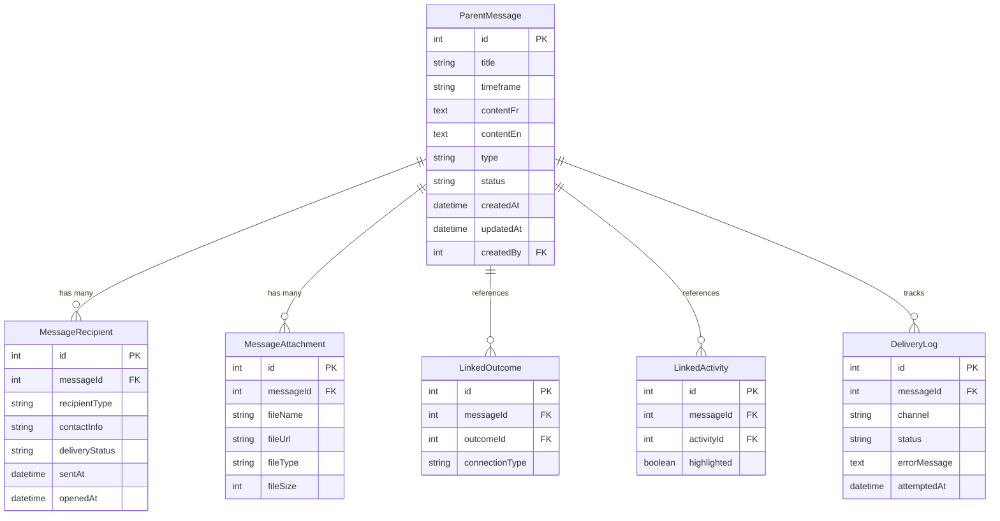
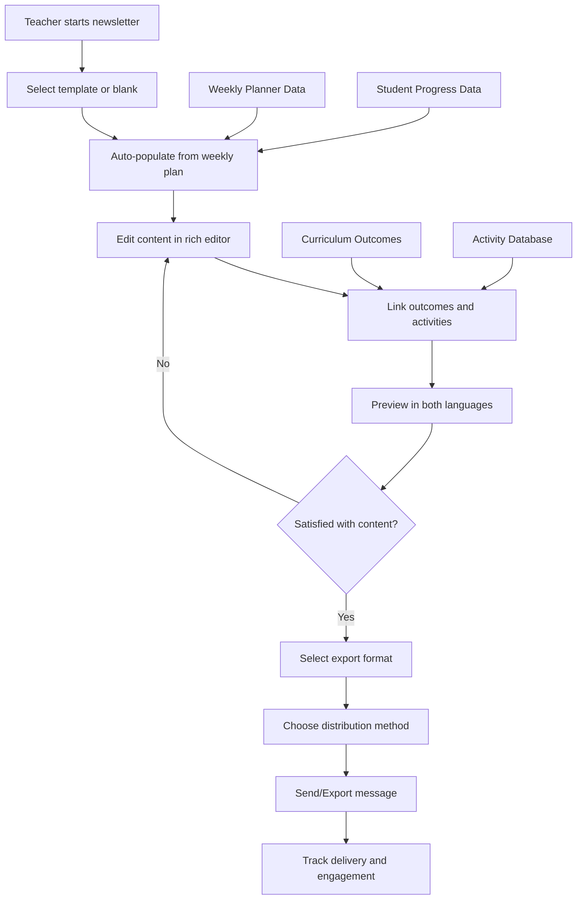

# Parent Communication Center - Technical Specification

## Overview

The Parent Communication Center is the central hub for all teacher-to-parent communications in Teaching Engine 2.0. It provides a unified interface for creating newsletters, individual messages, and automated communications while supporting bilingual content (French/English) and multiple export formats.

### System Integration
- Integrates with WeeklyPlanner for activity highlights
- Connects to Student data for personalized content
- Links with Assessment system for progress updates
- Supports Family Portal for parent viewing

### Primary User Benefits
- Reduces communication preparation time by 70%
- Ensures consistent, professional messaging
- Provides bilingual support for French Immersion programs
- Enables bulk communication with personalization
- Tracks engagement and delivery metrics

## Requirements

### Functional Requirements

#### Message Creation and Management
- **FR-001**: Teachers can create newsletters with rich text content
- **FR-002**: System supports bilingual content creation (French/English)
- **FR-003**: Teachers can link curriculum outcomes to communications
- **FR-004**: Teachers can attach activities and student work examples
- **FR-005**: System provides template library for common communications
- **FR-006**: Teachers can save drafts and return to edit later
- **FR-007**: System auto-generates content suggestions from weekly plans

#### Content Personalization
- **FR-008**: Individual student mentions can be included (with privacy controls)
- **FR-009**: Class-wide achievements can be highlighted
- **FR-010**: Learning goals and progress can be automatically included
- **FR-011**: Upcoming events and deadlines are auto-populated
- **FR-012**: Home connection activities are suggested based on curriculum

#### Distribution and Export
- **FR-013**: Multiple export formats supported (HTML, PDF, Markdown)
- **FR-014**: Email delivery integration for direct sending
- **FR-015**: Family portal integration for online viewing
- **FR-016**: Print-friendly formatting for physical distribution
- **FR-017**: Bulk sending with individual personalization

### Non-Functional Requirements

#### Performance
- **NFR-001**: Newsletter generation completes within 30 seconds
- **NFR-002**: System supports 100+ concurrent users
- **NFR-003**: Export generation completes within 2 minutes
- **NFR-004**: Real-time preview updates within 500ms

#### Security and Privacy
- **NFR-005**: All parent contact data encrypted at rest
- **NFR-006**: FERPA-compliant student data handling
- **NFR-007**: User authentication required for all operations
- **NFR-008**: Audit trail for all communication activities

#### Usability
- **NFR-009**: WCAG 2.1 AA accessibility compliance
- **NFR-010**: Mobile-responsive design for tablet use
- **NFR-011**: Intuitive workflow requiring minimal training
- **NFR-012**: Bilingual interface support

### Integration Requirements

#### Internal Systems
- **IR-001**: Real-time data sync with WeeklyPlanner
- **IR-002**: Student data integration from Student Management
- **IR-003**: Outcome data from Curriculum Management
- **IR-004**: Assessment data from Evaluation system

#### External Services
- **IR-005**: Email delivery service (SendGrid/Mailgun)
- **IR-006**: Translation service integration (optional)
- **IR-007**: File storage service for attachments
- **IR-008**: Analytics service for engagement tracking

## Architecture

### Database Schema



### API Endpoints

#### Message Management
```typescript
// Create new message
POST /api/communication/messages
{
  title: string;
  timeframe: string;
  contentFr?: string;
  contentEn?: string;
  type: 'newsletter' | 'individual' | 'announcement';
  linkedOutcomes?: number[];
  linkedActivities?: number[];
}

// Update existing message
PATCH /api/communication/messages/:id
{
  title?: string;
  timeframe?: string;
  contentFr?: string;
  contentEn?: string;
  linkedOutcomes?: number[];
  linkedActivities?: number[];
}

// Get message list
GET /api/communication/messages
Query: {
  page?: number;
  limit?: number;
  type?: string;
  status?: string;
  dateFrom?: string;
  dateTo?: string;
}

// Get single message
GET /api/communication/messages/:id

// Delete message
DELETE /api/communication/messages/:id
```

#### Content Generation
```typescript
// Generate content suggestions
POST /api/communication/suggestions
{
  weekStart: string;
  weekEnd: string;
  includeActivities: boolean;
  includeOutcomes: boolean;
  tone: 'formal' | 'friendly' | 'celebratory';
}

// Auto-populate from weekly plan
POST /api/communication/auto-populate
{
  messageId: number;
  weekId: number;
  sections: string[];
}

// Translate content
POST /api/communication/translate
{
  text: string;
  fromLanguage: 'fr' | 'en';
  toLanguage: 'fr' | 'en';
}
```

#### Export and Delivery
```typescript
// Export message
POST /api/communication/messages/:id/export
{
  format: 'html' | 'pdf' | 'markdown';
  language: 'fr' | 'en' | 'both';
  includeAttachments: boolean;
}

// Send message
POST /api/communication/messages/:id/send
{
  recipients: Array<{
    type: 'email' | 'portal';
    address: string;
    studentId?: number;
  }>;
  sendTime?: string; // For scheduling
}

// Get delivery status
GET /api/communication/messages/:id/delivery
```

### Frontend Components Structure

```
/client/src/components/communication/
├── ParentCenter/
│   ├── MessageComposer.tsx          # Main composition interface
│   ├── MessagePreview.tsx           # Live preview with language toggle
│   ├── MessageList.tsx              # List of all messages
│   ├── MessageEditor.tsx            # Rich text editor component
│   ├── LinkingPanel.tsx             # Outcome/activity linking
│   └── TranslationToggle.tsx        # Language switching
├── ContentGeneration/
│   ├── SuggestionEngine.tsx         # AI-powered content suggestions
│   ├── WeeklyPlanImporter.tsx       # Import from weekly planner
│   ├── TemplateLibrary.tsx          # Reusable message templates
│   └── AutoPopulator.tsx            # Auto-fill from system data
├── Distribution/
│   ├── ExportPanel.tsx              # Export format selection
│   ├── RecipientManager.tsx         # Manage parent contact lists
│   ├── DeliveryTracker.tsx          # Track message delivery
│   └── ScheduleManager.tsx          # Schedule message sending
└── Analytics/
    ├── EngagementDashboard.tsx      # View message engagement
    ├── DeliveryReport.tsx           # Delivery success rates
    └── FeedbackCollector.tsx        # Collect parent feedback
```

### Data Flow



## Implementation Details

### Content Generation Algorithm

#### Automated Content Suggestions
```typescript
interface ContentSuggestion {
  section: 'highlights' | 'celebrations' | 'upcoming' | 'homeConnection';
  content: {
    french: string;
    english: string;
  };
  confidence: number;
  sourceData: {
    activities?: Activity[];
    outcomes?: Outcome[];
    progress?: StudentProgress[];
  };
}

class ContentGenerator {
  async generateSuggestions(
    weekData: WeeklyPlanData,
    tone: 'formal' | 'friendly' | 'celebratory'
  ): Promise<ContentSuggestion[]> {
    // Algorithm implementation
    // 1. Extract completed activities
    // 2. Identify significant achievements
    // 3. Gather upcoming important events
    // 4. Generate home connection ideas
    // 5. Apply tone and language preferences
  }
}
```

#### Bilingual Content Management
```typescript
interface BilingualContent {
  french: string;
  english: string;
  syncStatus: 'synchronized' | 'french_ahead' | 'english_ahead';
  lastModified: {
    french: Date;
    english: Date;
  };
}

class BilingualEditor {
  // Ensures content parity between languages
  // Provides translation suggestions
  // Tracks editing state for both versions
  // Supports simultaneous editing workflow
}
```

### Export Engine

#### PDF Generation
```typescript
class PDFExporter {
  async generatePDF(
    message: ParentMessage,
    options: {
      language: 'fr' | 'en' | 'both';
      template: string;
      branding: SchoolBranding;
    }
  ): Promise<Buffer> {
    // Use Puppeteer for HTML to PDF conversion
    // Apply school branding and styling
    // Ensure proper formatting for printing
    // Include headers, footers, and page numbers
  }
}
```

#### HTML Export
```typescript
class HTMLExporter {
  async generateHTML(
    message: ParentMessage,
    options: ExportOptions
  ): Promise<string> {
    // Generate clean, semantic HTML
    // Include inline CSS for email compatibility
    // Ensure mobile responsiveness
    // Add tracking pixels for analytics
  }
}
```

### Integration with WeeklyPlanner

#### Data Sync
```typescript
interface WeeklyPlannerIntegration {
  // Add share button to weekly planner
  onShareWithParents(weekData: WeekData): void;
  
  // Extract highlights for newsletter
  extractHighlights(weekData: WeekData): ActivityHighlight[];
  
  // Generate parent-friendly summaries
  generateSummary(activities: Activity[]): BilingualContent;
}
```

#### UI Integration
```typescript
// Add to WeeklyPlanner component
interface WeeklyPlannerProps {
  // ... existing props
  onShareWithParents?: (weekData: WeekData) => void;
  parentSharingEnabled?: boolean;
}

// Share button in planner toolbar
<ShareButton 
  onClick={() => onShareWithParents(currentWeekData)}
  tooltip="Create parent newsletter from this week"
/>
```

## Testing Strategy

### Unit Test Scenarios

#### Message Creation
```typescript
describe('MessageComposer', () => {
  test('creates bilingual message with valid content', () => {
    // Test bilingual content creation
    // Verify validation rules
    // Check auto-save functionality
  });
  
  test('links outcomes and activities correctly', () => {
    // Test outcome selection
    // Verify activity linking
    // Check data persistence
  });
  
  test('handles content suggestions appropriately', () => {
    // Test suggestion generation
    // Verify suggestion application
    // Check suggestion quality
  });
});
```

#### Export Functionality
```typescript
describe('ExportEngine', () => {
  test('generates valid PDF with correct formatting', () => {
    // Test PDF generation
    // Verify formatting and layout
    // Check file size and quality
  });
  
  test('creates HTML with proper email compatibility', () => {
    // Test HTML export
    // Verify email client compatibility
    // Check responsive design
  });
  
  test('handles large content and attachments', () => {
    // Test performance with large content
    // Verify attachment handling
    // Check memory usage
  });
});
```

### Integration Test Requirements

#### Cross-Agent Integration
```typescript
describe('Communication Integration', () => {
  test('imports data from WeeklyPlanner correctly', () => {
    // Test data import from planner
    // Verify activity extraction
    // Check outcome mapping
  });
  
  test('syncs with student progress data', () => {
    // Test student data integration
    // Verify privacy controls
    // Check data accuracy
  });
  
  test('coordinates with assessment system', () => {
    // Test assessment data integration
    // Verify report generation
    // Check data consistency
  });
});
```

#### External Service Integration
```typescript
describe('External Services', () => {
  test('delivers emails successfully', () => {
    // Test email delivery
    // Verify delivery confirmation
    // Check error handling
  });
  
  test('handles email service failures gracefully', () => {
    // Test service downtime scenarios
    // Verify fallback mechanisms
    // Check retry logic
  });
});
```

### E2E Test Flows

#### Newsletter Creation Workflow
1. Teacher navigates to communication center
2. Creates new newsletter from weekly planner
3. Edits content in both languages
4. Links relevant outcomes and activities
5. Previews final newsletter
6. Exports to PDF and sends to parents
7. Tracks delivery and engagement

#### Individual Communication Workflow
1. Teacher selects individual student
2. Creates personalized message
3. Includes specific progress information
4. Sends through multiple channels
5. Receives delivery confirmation
6. Tracks parent response

## Deployment Considerations

### Environment Variables
```bash
# Email service configuration
SENDGRID_API_KEY=your_sendgrid_key
SENDGRID_FROM_EMAIL=noreply@school.edu
SENDGRID_FROM_NAME="Teaching Engine 2.0"

# File storage configuration
AWS_S3_BUCKET=teaching-engine-files
AWS_S3_REGION=us-east-1

# Translation service (optional)
GOOGLE_TRANSLATE_API_KEY=your_translate_key

# Feature flags
ENABLE_EMAIL_DELIVERY=true
ENABLE_AUTO_TRANSLATION=false
ENABLE_ANALYTICS_TRACKING=true
```

### Database Migrations
```sql
-- Migration: Create parent communication tables
CREATE TABLE parent_messages (
  id SERIAL PRIMARY KEY,
  title VARCHAR(255) NOT NULL,
  timeframe VARCHAR(100),
  content_fr TEXT,
  content_en TEXT,
  type VARCHAR(50) NOT NULL,
  status VARCHAR(50) DEFAULT 'draft',
  created_at TIMESTAMP DEFAULT NOW(),
  updated_at TIMESTAMP DEFAULT NOW(),
  created_by INTEGER REFERENCES users(id)
);

-- Additional tables for recipients, attachments, etc.
-- Include indexes for performance
-- Add foreign key constraints
```

### Infrastructure Changes
- Email service account setup (SendGrid/Mailgun)
- File storage bucket configuration (AWS S3)
- CDN setup for static assets
- Monitoring and alerting configuration

### Rollback Procedures
1. Database rollback scripts for schema changes
2. Feature flag toggles for gradual rollout
3. Email service fallback to manual sending
4. Data export procedures for migration

## Success Criteria

### Measurable Acceptance Criteria
- **Time Savings**: 70% reduction in newsletter creation time (from 45 min to 15 min)
- **User Adoption**: 90% of teachers use system within 30 days
- **Quality Score**: 95% of generated content requires minimal editing
- **Delivery Success**: 99% email delivery success rate
- **Parent Satisfaction**: 85% positive feedback on communication quality

### Performance Targets
- Newsletter generation: < 30 seconds for typical content
- Export generation: < 2 minutes for PDF with images
- System response time: < 500ms for UI interactions
- Concurrent users: Support 100+ simultaneous users

### User Experience Goals
- **Intuitive Workflow**: New users can create newsletter in < 10 minutes
- **Accessibility**: Full WCAG 2.1 AA compliance
- **Mobile Compatibility**: Fully functional on tablets
- **Language Support**: Seamless bilingual content creation
- **Error Recovery**: Clear error messages with actionable solutions

### Integration Success Metrics
- **Data Accuracy**: 100% accurate data import from WeeklyPlanner
- **Cross-Agent Coordination**: Zero conflicts with parallel development
- **API Reliability**: 99.9% uptime for communication endpoints
- **Security Compliance**: Pass all security audits and penetration tests