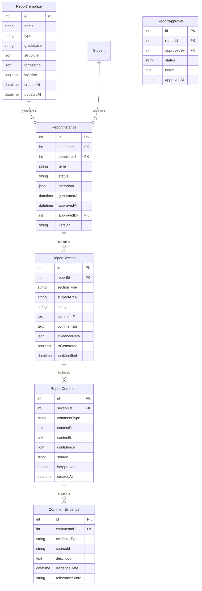
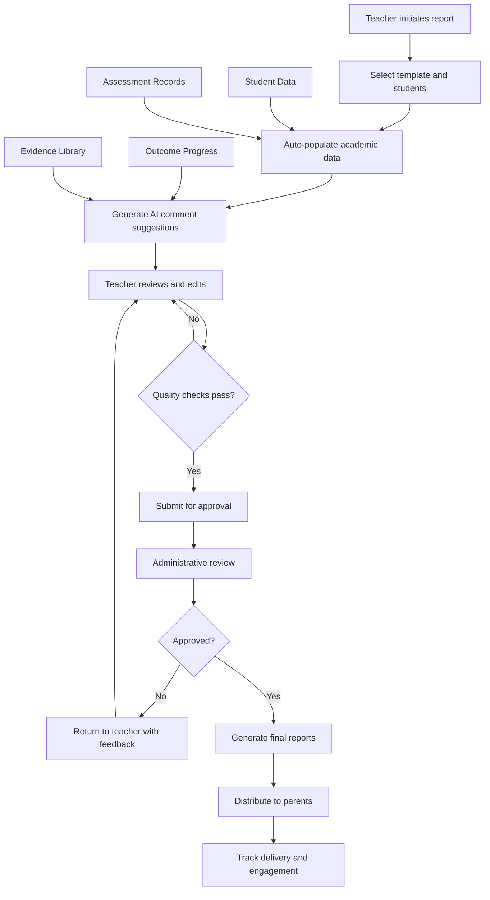

# Report Generation System - Technical Specification

## Overview

The Report Generation System provides comprehensive tools for creating, customizing, and distributing formal academic reports, including report cards, progress summaries, and narrative reports. The system supports bilingual content generation, AI-assisted comment writing, and multiple export formats while maintaining compliance with educational standards.

### System Integration
- Integrates with Student Management for academic data
- Connects to Assessment System for evaluation records
- Links with Communication Center for distribution
- Supports Family Portal for parent access

### Primary User Benefits
- Reduces report creation time by 80% through automation
- Ensures consistent, professional formatting across all reports
- Provides AI-assisted comment generation with teacher oversight
- Enables bulk report generation with individual customization
- Maintains audit trail for compliance and accountability

## Requirements

### Functional Requirements

#### Report Types and Templates
- **FR-001**: System supports multiple report types (term reports, progress reports, narrative summaries)
- **FR-002**: Customizable report templates with school branding
- **FR-003**: Bilingual report generation (French/English) with accurate translations
- **FR-004**: Grade/level appropriate comment templates and vocabulary
- **FR-005**: Support for mixed grade classes with differentiated reporting

#### Content Generation and Management
- **FR-006**: AI-assisted comment generation based on evidence and observations
- **FR-007**: Manual comment editing with real-time preview
- **FR-008**: Comment library with reusable phrases and templates
- **FR-009**: Automatic population of academic data (grades, attendance, outcomes)
- **FR-010**: Evidence linking to support narrative comments
- **FR-011**: Goal setting and next steps recommendations

#### Quality Assurance and Review
- **FR-012**: Spell check and grammar validation for both languages
- **FR-013**: Consistency checking across subject areas
- **FR-014**: Approval workflow for report review and sign-off
- **FR-015**: Version control for report drafts and revisions
- **FR-016**: Bulk review interface for class-wide report management

#### Distribution and Export
- **FR-017**: Multiple export formats (PDF, DOC, HTML)
- **FR-018**: Email distribution with delivery tracking
- **FR-019**: Family portal integration for secure online access
- **FR-020**: Print-optimized formatting with page breaks
- **FR-021**: Batch processing for class-wide report generation

### Non-Functional Requirements

#### Performance and Scalability
- **NFR-001**: Individual report generation within 60 seconds
- **NFR-002**: Batch report generation (30 students) within 5 minutes
- **NFR-003**: System supports 500+ concurrent report generations
- **NFR-004**: 99.5% uptime during peak reporting periods

#### Security and Compliance
- **NFR-005**: FERPA-compliant student data handling
- **NFR-006**: Encrypted storage of all report data
- **NFR-007**: Audit trail for all report access and modifications
- **NFR-008**: Role-based access control for report viewing
- **NFR-009**: Secure parent authentication for online access

#### Quality and Accuracy
- **NFR-010**: 95% accuracy in auto-generated content
- **NFR-011**: Consistent formatting across all report types
- **NFR-012**: Translation accuracy verified by certified translators
- **NFR-013**: Data integrity validation for all academic records

### Integration Requirements

#### Internal System Integration
- **IR-001**: Real-time data sync with Student Information System
- **IR-002**: Assessment data integration from grading systems
- **IR-003**: Attendance and behavior data inclusion
- **IR-004**: Curriculum outcome mapping and progress tracking

#### External Service Integration
- **IR-005**: Email service integration for distribution
- **IR-006**: Translation service for content localization
- **IR-007**: Document conversion services for multiple formats
- **IR-008**: Cloud storage for report archival

## Architecture

### Database Schema



### API Endpoints Structure

#### Report Management
```typescript
// Report CRUD operations
POST /api/reports/generate
GET /api/reports/
GET /api/reports/:id
PATCH /api/reports/:id
DELETE /api/reports/:id

// Report workflow
POST /api/reports/:id/submit-review
POST /api/reports/:id/approve
POST /api/reports/:id/reject
POST /api/reports/:id/publish

// Batch operations
POST /api/reports/batch/generate
GET /api/reports/batch/:batchId/status
POST /api/reports/batch/:batchId/approve
```

#### Comment Generation
```typescript
// AI comment generation
POST /api/reports/comments/generate
POST /api/reports/comments/suggestions
PATCH /api/reports/comments/:id
GET /api/reports/comments/templates

// Evidence management
POST /api/reports/evidence/link
GET /api/reports/evidence/search
DELETE /api/reports/evidence/:id
```

#### Export and Distribution
```typescript
// Export operations
POST /api/reports/:id/export
GET /api/reports/:id/download/:format
POST /api/reports/batch/export

// Distribution
POST /api/reports/:id/distribute
GET /api/reports/:id/delivery-status
POST /api/reports/notifications/send
```

### Frontend Components Structure

```
/client/src/components/reports/
├── ReportBuilder/
│   ├── ReportWizard.tsx             # Step-by-step report creation
│   ├── TemplateSelector.tsx         # Choose report template
│   ├── StudentSelector.tsx          # Select students for reports
│   ├── SectionEditor.tsx            # Edit individual report sections
│   ├── CommentEditor.tsx            # Rich text comment editing
│   └── PreviewPanel.tsx             # Live report preview
├── CommentGeneration/
│   ├── AICommentGenerator.tsx       # AI-powered comment creation
│   ├── CommentSuggestions.tsx       # Suggestion panel
│   ├── CommentLibrary.tsx           # Reusable comment templates
│   ├── EvidenceLinker.tsx           # Link evidence to comments
│   └── TranslationHelper.tsx        # Bilingual editing support
├── ReviewWorkflow/
│   ├── ReportReviewer.tsx           # Report review interface
│   ├── ApprovalQueue.tsx            # Pending approvals list
│   ├── ComparisonView.tsx           # Compare report versions
│   ├── QualityChecker.tsx           # Automated quality checks
│   └── BulkActions.tsx              # Batch approval/rejection
├── Distribution/
│   ├── DistributionManager.tsx      # Manage report distribution
│   ├── ExportOptions.tsx            # Export format selection
│   ├── DeliveryTracker.tsx          # Track distribution status
│   ├── ParentPortalLink.tsx         # Portal access management
│   └── PrintManager.tsx             # Print formatting options
└── Analytics/
    ├── ReportAnalytics.tsx          # Report generation statistics
    ├── EngagementMetrics.tsx        # Parent engagement tracking
    ├── QualityMetrics.tsx           # Report quality assessment
    └── ComplianceReporter.tsx       # Compliance and audit reports
```

### Data Flow Architecture



## Implementation Details

### AI Comment Generation Engine

#### Comment Generation Algorithm
```typescript
interface CommentGenerationRequest {
  studentId: number;
  subjectArea: string;
  term: string;
  commentType: 'strength' | 'growth' | 'nextSteps';
  tone: 'formal' | 'encouraging' | 'constructive';
  language: 'fr' | 'en';
  evidenceIds?: number[];
}

interface CommentGenerationResponse {
  suggestions: CommentSuggestion[];
  confidence: number;
  evidenceSummary: EvidenceSummary;
  alternatives: string[];
}

class CommentGenerator {
  async generateComment(
    request: CommentGenerationRequest
  ): Promise<CommentGenerationResponse> {
    // 1. Analyze student evidence and data
    const evidence = await this.gatherEvidence(request.studentId, request.subjectArea);
    
    // 2. Apply contextual analysis
    const context = await this.analyzeContext(evidence, request.term);
    
    // 3. Generate comment using AI model
    const suggestions = await this.generateSuggestions(context, request);
    
    // 4. Validate and rank suggestions
    const rankedSuggestions = await this.rankSuggestions(suggestions, context);
    
    return {
      suggestions: rankedSuggestions,
      confidence: this.calculateConfidence(rankedSuggestions, evidence),
      evidenceSummary: this.summarizeEvidence(evidence),
      alternatives: this.generateAlternatives(rankedSuggestions[0])
    };
  }
}
```

#### Evidence Analysis
```typescript
interface EvidenceData {
  assessmentScores: AssessmentScore[];
  observationNotes: ObservationNote[];
  artifactLinks: ArtifactLink[];
  outcomeProgress: OutcomeProgress[];
  behaviorRecords: BehaviorRecord[];
}

class EvidenceAnalyzer {
  analyzeStudentProgress(evidence: EvidenceData): ProgressAnalysis {
    // Analyze trends in assessment data
    // Identify strengths and growth areas
    // Calculate progress metrics
    // Generate evidence-based insights
  }
  
  generateKeyInsights(analysis: ProgressAnalysis): string[] {
    // Extract meaningful patterns
    // Identify notable achievements
    // Highlight areas for development
    // Create actionable recommendations
  }
}
```

### Report Template System

#### Template Configuration
```typescript
interface ReportTemplate {
  id: number;
  name: string;
  type: 'termReport' | 'progressReport' | 'narrativeReport';
  gradeLevel: string;
  structure: ReportSection[];
  formatting: FormatConfiguration;
  languages: ('fr' | 'en')[];
  isActive: boolean;
}

interface ReportSection {
  id: string;
  title: BilingualText;
  type: 'academic' | 'behavioral' | 'social' | 'comments';
  fields: SectionField[];
  isRequired: boolean;
  order: number;
}

interface SectionField {
  name: string;
  type: 'rating' | 'text' | 'comment' | 'grade';
  validation: ValidationRule[];
  defaultValue?: any;
  isEditable: boolean;
}
```

#### Dynamic Report Generation
```typescript
class ReportGenerator {
  async generateReport(
    templateId: number,
    studentId: number,
    term: string
  ): Promise<ReportInstance> {
    // 1. Load template configuration
    const template = await this.loadTemplate(templateId);
    
    // 2. Gather student data
    const studentData = await this.gatherStudentData(studentId, term);
    
    // 3. Generate report sections
    const sections = await this.generateSections(template, studentData);
    
    // 4. Create report instance
    const report = await this.createReportInstance({
      studentId,
      templateId,
      term,
      sections,
      status: 'draft'
    });
    
    return report;
  }
}
```

### Quality Assurance System

#### Automated Quality Checks
```typescript
interface QualityCheck {
  name: string;
  type: 'spelling' | 'grammar' | 'consistency' | 'completeness';
  severity: 'error' | 'warning' | 'suggestion';
  rule: ValidationRule;
}

class QualityAssurance {
  async validateReport(report: ReportInstance): Promise<ValidationResult[]> {
    const results: ValidationResult[] = [];
    
    // Spelling and grammar checks
    results.push(...await this.checkSpelling(report));
    results.push(...await this.checkGrammar(report));
    
    // Content consistency checks
    results.push(...await this.checkConsistency(report));
    
    // Completeness validation
    results.push(...await this.checkCompleteness(report));
    
    // Cross-language validation for bilingual reports
    if (report.languages.length > 1) {
      results.push(...await this.validateTranslations(report));
    }
    
    return results;
  }
}
```

#### Review Workflow
```typescript
enum ApprovalStatus {
  DRAFT = 'draft',
  SUBMITTED = 'submitted',
  UNDER_REVIEW = 'under_review',
  APPROVED = 'approved',
  REJECTED = 'rejected',
  PUBLISHED = 'published'
}

class ReviewWorkflow {
  async submitForReview(reportId: number): Promise<void> {
    // Validate report quality
    const qualityResults = await this.qualityAssurance.validate(reportId);
    
    if (qualityResults.some(r => r.severity === 'error')) {
      throw new Error('Report has validation errors');
    }
    
    // Update status and notify reviewers
    await this.updateReportStatus(reportId, ApprovalStatus.SUBMITTED);
    await this.notifyReviewers(reportId);
  }
  
  async approveReport(reportId: number, approverId: number): Promise<void> {
    // Record approval
    await this.recordApproval(reportId, approverId);
    
    // Update status
    await this.updateReportStatus(reportId, ApprovalStatus.APPROVED);
    
    // Notify teacher
    await this.notifyApproval(reportId);
  }
}
```

### Export and Distribution System

#### Multi-Format Export
```typescript
interface ExportOptions {
  format: 'pdf' | 'docx' | 'html';
  language: 'fr' | 'en' | 'both';
  includeEvidence: boolean;
  watermark?: string;
  customFormatting?: FormatOverrides;
}

class ExportEngine {
  async exportReport(
    reportId: number,
    options: ExportOptions
  ): Promise<ExportResult> {
    const report = await this.loadReport(reportId);
    
    switch (options.format) {
      case 'pdf':
        return await this.generatePDF(report, options);
      case 'docx':
        return await this.generateDOCX(report, options);
      case 'html':
        return await this.generateHTML(report, options);
      default:
        throw new Error(`Unsupported format: ${options.format}`);
    }
  }
  
  private async generatePDF(
    report: ReportInstance,
    options: ExportOptions
  ): Promise<ExportResult> {
    // Use HTML-to-PDF conversion with custom styling
    // Apply school branding and formatting
    // Ensure proper page breaks and layout
    // Include digital signatures if required
  }
}
```

#### Distribution Management
```typescript
interface DistributionPlan {
  reportIds: number[];
  channels: DistributionChannel[];
  schedule?: Date;
  notifications: NotificationSettings;
}

interface DistributionChannel {
  type: 'email' | 'portal' | 'print';
  recipients: Recipient[];
  format: 'pdf' | 'html';
  options: ChannelOptions;
}

class DistributionManager {
  async distributeReports(plan: DistributionPlan): Promise<DistributionResult> {
    const results: ChannelResult[] = [];
    
    for (const channel of plan.channels) {
      const result = await this.distributeViaChannel(
        plan.reportIds,
        channel
      );
      results.push(result);
    }
    
    return {
      distributionId: this.generateDistributionId(),
      results,
      summary: this.summarizeResults(results),
      completedAt: new Date()
    };
  }
}
```

## Testing Strategy

### Unit Test Coverage

#### Comment Generation Tests
```typescript
describe('CommentGenerator', () => {
  describe('generateComment', () => {
    test('generates appropriate comments for different subject areas', async () => {
      // Test math comments include numerical reasoning
      // Test language arts comments focus on communication skills
      // Test science comments emphasize inquiry and observation
    });
    
    test('adjusts tone based on student performance', async () => {
      // Test encouraging tone for struggling students
      // Test celebratory tone for high achievers
      // Test constructive tone for mixed performance
    });
    
    test('maintains consistency in bilingual comments', async () => {
      // Test French and English comments convey same meaning
      // Test cultural appropriateness of translations
      // Test terminology consistency across languages
    });
  });
});
```

#### Report Generation Tests
```typescript
describe('ReportGenerator', () => {
  test('generates complete reports with all required sections', async () => {
    // Test all template sections are populated
    // Test required fields are not empty
    // Test data accuracy and consistency
  });
  
  test('handles missing data gracefully', async () => {
    // Test behavior when assessment data is incomplete
    // Test fallback content for missing evidence
    // Test error handling for invalid student data
  });
  
  test('maintains data integrity across report versions', async () => {
    // Test version control functionality
    // Test audit trail creation
    // Test rollback capabilities
  });
});
```

### Integration Test Requirements

#### Cross-System Integration
```typescript
describe('Report System Integration', () => {
  test('syncs with student information system', async () => {
    // Test real-time data synchronization
    // Test data consistency validation
    // Test error handling for sync failures
  });
  
  test('integrates with assessment platform', async () => {
    // Test grade import functionality
    // Test outcome progress tracking
    // Test evidence linking accuracy
  });
  
  test('coordinates with communication system', async () => {
    // Test report distribution workflows
    // Test parent notification delivery
    // Test portal access management
  });
});
```

#### External Service Integration
```typescript
describe('External Service Integration', () => {
  test('email delivery service integration', async () => {
    // Test email formatting and delivery
    // Test delivery tracking and confirmations
    // Test bounce handling and retries
  });
  
  test('document conversion service integration', async () => {
    // Test PDF generation quality
    // Test DOCX export functionality
    // Test format preservation accuracy
  });
});
```

### E2E Test Scenarios

#### Complete Report Generation Workflow
1. Teacher logs in and accesses report generation
2. Selects students and report template
3. Reviews auto-generated content and makes edits
4. Submits report for administrative approval
5. Administrator reviews and approves report
6. System generates final reports and distributes to parents
7. Parents access reports through family portal
8. System tracks engagement and delivery metrics

#### Bulk Report Processing
1. Administrator initiates batch report generation
2. System processes multiple students simultaneously
3. Quality checks are applied to all reports
4. Reports are queued for approval workflow
5. Approved reports are batch exported and distributed
6. Delivery status is tracked for all recipients

## Deployment Considerations

### Environment Configuration
```bash
# Report generation settings
REPORT_GENERATION_TIMEOUT=300000
MAX_CONCURRENT_REPORTS=10
REPORT_STORAGE_PATH=/data/reports
TEMP_FILE_CLEANUP_INTERVAL=3600

# AI service configuration
AI_SERVICE_ENDPOINT=https://api.openai.com/v1
AI_MODEL_NAME=gpt-4
AI_MAX_TOKENS=2000
AI_TEMPERATURE=0.3

# Export service settings
PDF_SERVICE_URL=https://pdf-converter.internal
DOCX_SERVICE_URL=https://docx-converter.internal
EXPORT_QUALITY=high
EXPORT_TIMEOUT=120000

# Distribution settings
EMAIL_SERVICE_PROVIDER=sendgrid
EMAIL_RATE_LIMIT=100
PORTAL_BASE_URL=https://portal.school.edu
DISTRIBUTION_BATCH_SIZE=50
```

### Database Migrations
```sql
-- Migration: Create report generation tables
CREATE TABLE report_templates (
  id SERIAL PRIMARY KEY,
  name VARCHAR(255) NOT NULL,
  type VARCHAR(100) NOT NULL,
  grade_level VARCHAR(50),
  structure JSONB NOT NULL,
  formatting JSONB,
  languages VARCHAR(10)[] DEFAULT ARRAY['en'],
  is_active BOOLEAN DEFAULT true,
  created_at TIMESTAMP DEFAULT NOW(),
  updated_at TIMESTAMP DEFAULT NOW()
);

CREATE TABLE report_instances (
  id SERIAL PRIMARY KEY,
  student_id INTEGER REFERENCES students(id),
  template_id INTEGER REFERENCES report_templates(id),
  term VARCHAR(100) NOT NULL,
  status VARCHAR(50) DEFAULT 'draft',
  metadata JSONB,
  generated_at TIMESTAMP DEFAULT NOW(),
  approved_at TIMESTAMP,
  approved_by INTEGER REFERENCES users(id),
  version INTEGER DEFAULT 1
);

-- Additional indexes for performance
CREATE INDEX idx_report_instances_student_term ON report_instances(student_id, term);
CREATE INDEX idx_report_instances_status ON report_instances(status);
CREATE INDEX idx_report_instances_generated_at ON report_instances(generated_at);
```

### Infrastructure Requirements
- High-performance servers for AI comment generation
- Scalable file storage for report documents
- Email service integration for distribution
- Backup and archival systems for compliance
- Monitoring and alerting for system health

### Rollback Procedures
1. Database rollback scripts for schema changes
2. Template version control for safe rollbacks
3. Report instance backup and recovery
4. Feature flags for gradual deployment
5. Emergency procedures for critical failures

## Success Criteria

### Performance Metrics
- **Report Generation Speed**: Individual reports generated within 60 seconds
- **Batch Processing**: 30 student reports completed within 5 minutes
- **AI Comment Quality**: 95% of generated comments accepted without major edits
- **System Reliability**: 99.5% uptime during peak reporting periods
- **Export Performance**: PDF generation within 30 seconds for standard reports

### User Experience Goals
- **Ease of Use**: Teachers can generate complete report in under 15 minutes
- **Quality Assurance**: Built-in validation catches 99% of common errors
- **Collaboration**: Review workflow reduces approval time by 60%
- **Accessibility**: Full WCAG 2.1 AA compliance for all interfaces
- **Mobile Support**: Tablet-optimized interface for review and approval

### Educational Impact
- **Time Savings**: 80% reduction in report creation time compared to manual process
- **Consistency**: Standardized formatting and quality across all reports
- **Personalization**: AI-generated comments reflect individual student progress
- **Communication**: Improved parent engagement through timely, detailed reports
- **Compliance**: 100% adherence to educational reporting standards and regulations